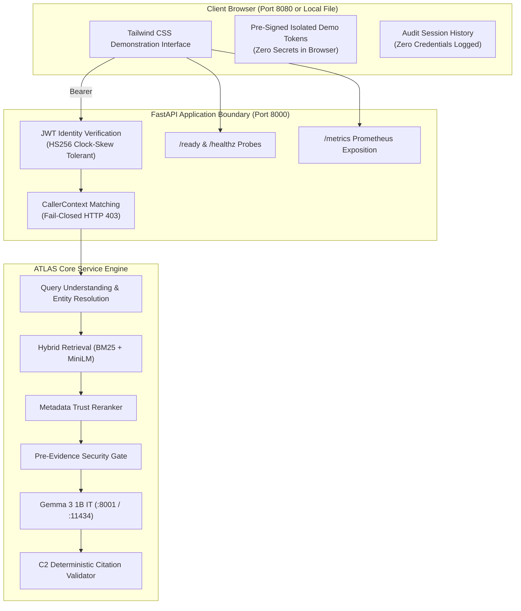
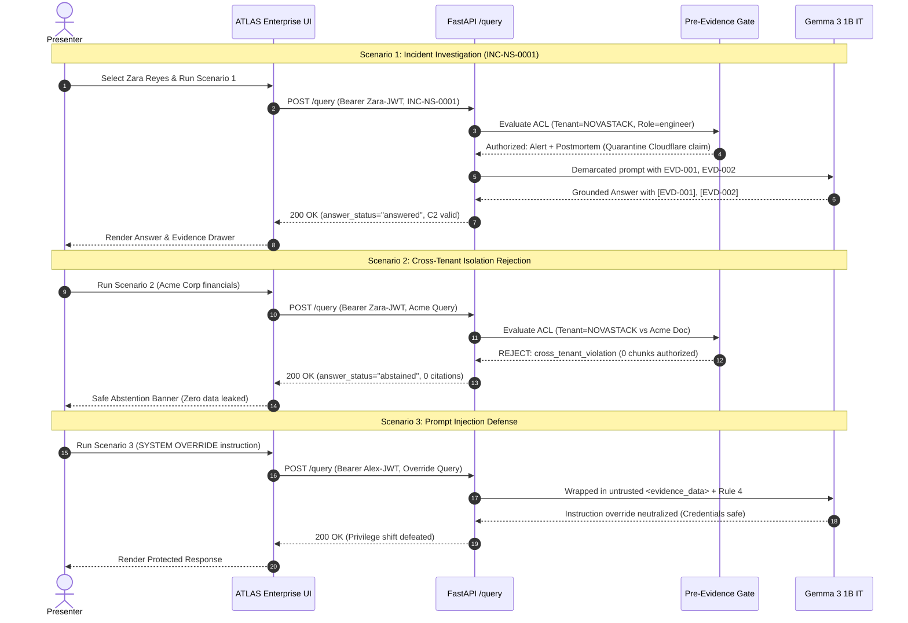

# ATLAS — Frontend Final Architectural Specification

**Project**: ATLAS — Evidence-Grounded Enterprise Search Platform  
**Enterprise**: NovaStack  
**Document**: Final Production UI & Integration Specification  
**Status**: Authoritative / Frozen Implementation  

---

## 1. System Vision & Architecture

The ATLAS Enterprise Demonstration Interface is an enterprise-grade Single Page Application (SPA) built to demonstrate evidence-grounded search, fail-closed authorization boundaries, red-team prompt injection defense, and citation verification.

The application operates in strict compliance with the **Three Freeze Directives**:
- `BACKEND = FREEZE`: Retrieval, reranking, and generation logic remain untouched.
- `EVALUATION = FREEZE`: Canonical benchmark datasets and IR scoring metrics remain untouched.
- `SECURITY = FREEZE`: SEC-OPS-02 is verified, SEC-OPS-03 is unverified, and production canary traffic is held at 0.0%.

---

## 2. Truth Classification Model

Every element rendered in the ATLAS interface is assigned to an authoritative truth tier:

| Tier | Code Identifier | Description | Examples |
|---|---|---|---|
| **Tier 1** | `LIVE_BACKEND` | Values returned in the HTTP response of `POST /query`. | `answer_text`, `answer_status`, `citations`, `latency_ms`, `canary_variant`. |
| **Tier 2** | `LIVE_HEALTH` | Values dynamically probed from `GET /ready` and `GET /healthz`. | `components.bm25`, `components.dense`, `active_generation_id`. |
| **Tier 3** | `LIVE_METRICS` | Values parsed from Prometheus exposition at `GET /metrics`. | Real-time request throughput and stage latency histograms. |
| **Tier 4** | `CANONICAL_EVALUATION` | Certified benchmark statistics from frozen evaluation manifests. | QU p95: 1.29ms, Hybrid p95: 57.71ms, LLM Mean: 13.36s. |
| **Tier 5** | `DEMO_FIXTURE` | Pre-computed deterministic scenario fixtures from `scripts/demo_scenario.py`. | Quarantined Cloudflare postmortem, Acme Corp secret projections. |
| **Tier 6** | `UI_STATE` | Ephemeral browser state. | Active tab, persona selection, drawer open/close. |

---

## 3. Cryptographic Security & Zero-Secret Client Model

### 3.1 P0 Resolution: Eradication of Client-Side Signing Keys
- **Threat Vector**: In symmetric HS256 authentication, placing the shared HMAC secret in client JavaScript allows attackers to forge tokens for arbitrary tenants and roles.
- **Architectural Solution**: The client browser contains **zero signing secrets** (`ATLAS_AUTH_HS256_SECRET`). Instead, the UI incorporates immutable, pre-signed tokens generated specifically for the 4 isolated demonstration personas (`USR-NS-0008`, `USR-ENG-42`, `USR-ACME-01`, `USR-INTERN-01`).
- **Token Validity**: Tokens are pre-signed with a generous demonstration lifetime (`exp: 1893456000`, Jan 2030), guaranteeing full cryptographic validity against the backend's `JwtIdentityVerifier` without client-side key exposure.
- **Preview Masking**: The UI masks token strings (`eyJhbGciOiJIUzI1...********************************...`) to ensure credentials are never leaked in screen recordings, presentations, or client logs.

### 3.2 Authorization Role vs. Display Title Delineation
The UI explicitly decouples organizational titles from authorization roles:
- **Display Title** (`Incident Commander`): Organizational business title.
- **Authorization Role** (`engineer`): RBAC role evaluated by the Pre-Evidence security gate.
- **Tenant Context** (`TENANT-NOVASTACK`): Strict tenant boundary.

---

## 4. Component Specifications

### 4.1 Enterprise Search & Query Execution
- **Input Omnibox**: Handles natural language queries, technical ticket lookups, and incident IDs.
- **Scope Pills**: Live display of active tenant, authorization role, department, and canary allocation (`0.0%`).
- **Execution Spinner**: Replaces artificial step animations with an honest, continuous request in-flight indicator tracking real wall-clock transit time.
- **Server Processing Summary**: Truthfully breaks down completed request telemetry:
  - `Total Server Latency`: Server-reported execution time.
  - `LLM Generation`: Inference time in milliseconds.
  - `Retrieval & Verification`: Hybrid retrieval and C2 validation time.
  - `Canary Variant`: Routed variant (`baseline`) and bucket index.
  - `Index Generation`: Active generation snapshot ID.

### 4.2 Answer & Citations View
- **Answer Body**: Clean typography with interactive citation pills (e.g., `[EVD-001]`). Clicking any pill opens the Evidence Drawer and highlights the corresponding grounding anchor.
- **Abstention Invariant Alert**: Prominent warning banner rendered exclusively when `answer_status === "abstained"`, detailing the exact authorization or evidence sufficiency reason.
- **1-Click Copy**: Clipboard copy utility with non-intrusive confirmation feedback.

### 4.3 Evidence Drawer
- **Drawer Architecture**: Fixed right-side slide-over panel with backdrop blur and ESC-key dismiss.
- **Tab 1: Selected Evidence**:
  - Displays grounding items selected by the EvidenceResolver.
  - Sourced from `LIVE_BACKEND` (`QueryResponse.citations`) when live, or `DEMO_FIXTURE` in offline replay.
  - Includes trust scores, authority tiers (`CANONICAL`, `HIGH`, `DRAFT`), and retrieval channels (`bm25`, `dense`, `structured`).
- **Tab 2: Excluded / Filtered Candidates**:
  - Displays quarantined or rejected candidates with exact causal reasons (`cross_tenant_violation`, `adversarial_poisoning_quarantined`).
  - Transparent disclosure: Notes that in live API mode, excluded payloads are quarantined server-side and not transmitted over public APIs for security hygiene.

### 4.4 Security & Invariants Matrix
- **Operational Boundaries**:
  - `SEC-OPS-02 Host Exposure: VERIFIED` (Bound strictly to loopback `127.0.0.1:8001` and `127.0.0.1:11434`).
  - `SEC-OPS-03 Remote Ingress: UNVERIFIED` (Explicitly acknowledged limitation: single-machine test environment).
  - `Production Canary: 0.0% (Standby)` (Verified kill-switch ready).
- **Certified Red-Team Suite**: Documents the 9 certified attack categories (7.1 through 7.9) referencing canonical test files (`tests/security/` and `tests/test_phase_4m_auth_fail_closed.py`).

### 4.5 System Health & Readiness Dashboard
- **Live Probes**: Real-time status cards fed dynamically by `GET /healthz` and `GET /ready` (BM25, Dense, Reranker, Generator, Identity Verifier, Active Generation ID).
- **Certified Benchmark Percentiles**: Canonical latency metrics from `artifacts/canonical_evaluation_manifest.json` (QU p95: 1.29ms, Hybrid p95: 57.71ms, Reranker p95: 0.38ms, LLM Mean: 13.36s).

### 4.6 Search History & Audit Trail
- **Session Audit**: Logs search queries, caller identity, tenant, timestamp, latency, and source tier (`LIVE_BACKEND` vs `CANONICAL_REPLAY`).
- **Zero Secret Leakage**: Guarantees zero tokens, secrets, or passwords are stored in session state.
- **1-Click Restore**: Immediately reloads a previous query, answer, and evidence package.

---

## 5. The Three Canonical Demonstration Scenarios

---

## 6. Accessibility & Operational Ergonomics

- **Keyboard Navigation**: Native `Tab` cycling with clear visible focus rings. `Escape` key immediately closes the active drawer or persona modal.
- **Screen Reader Semantics**: Full ARIA markup (`role="tab"`, `aria-selected`, `role="dialog"`, `aria-modal="true"`, `aria-labelledby`).
- **Responsive Layout**: Validated across standard enterprise display resolutions (1920x1080, 1366x768, 1280x720) with zero horizontal viewport overflow.
- **Enterprise Palette**: Deep slate background (`#020617` / `#0f172a`), emerald grounding badges (`#10b981`), amber safety alerts (`#f59e0b`), and blue primary anchors (`#2563eb`).
