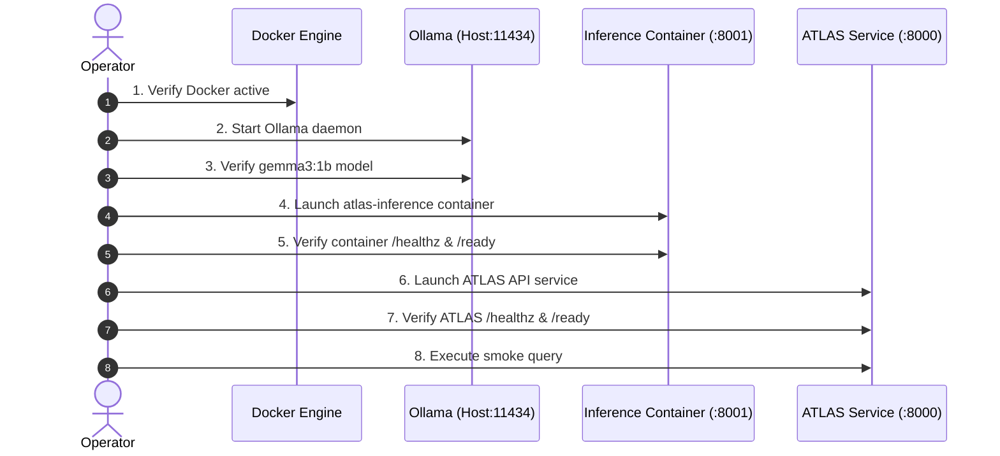

# ATLAS Operations Runbook

**Release Candidate**: `0.4.14-rc1`  
**Package Version**: `0.4.14`  
**Classification**: Operational Engineering Reference  
**Audience**: Operations Engineers, Release Managers, SREs  
**Status**: Authoritative / Production Certified  

---

## 1. Scope

This runbook defines the complete operational deployment, verification, recovery, rollback, and maintenance procedures for the **ATLAS Evidence-Grounded Enterprise Search Platform** (Release Candidate `0.4.14-rc1`).

This guide is designed for an operations engineer who did **not** build the system. It assumes no internal development context and provides exact, deterministic commands for deploying ATLAS strictly from release artifacts.

---

## 2. Certified Operating Envelope

ATLAS is certified strictly under the following single-node operating envelope:

| Parameter | Certified Specification | Operational Constraint |
|---|---|---|
| **Deployment Model** | Single-Node Host + Docker | No multi-node clustering, Kubernetes, or cloud-native orchestration |
| **Compute / Host** | Intel Core i3-N305 class (8 cores, x86_64) | Tested on standard x86_64 CPU hardware |
| **System Memory** | 8 GB Physical RAM | Sub-gigabyte operational RSS (~128MB ATLAS, ~35MB container, ~32MB Ollama) |
| **Acceleration** | None (CPU only) | Discrete GPUs are **not** required or tested |
| **Disk Storage** | $\ge 5$ GB Free Disk Space | Model weights (815 MB GGUF) + Docker images + OS |
| **Inference Concurrency** | Strictly 1 (`max_concurrent_inferences=1`) | System is **not** high-throughput; concurrency $>1$ sheds via HTTP 429 |
| **Request Timeout** | 30.0 seconds | Total client request deadline |
| **Queue Timeout** | 0.5 seconds | In-flight queue deadline before capacity shedding |
| **Circuit Breaker** | 3 consecutive failures / 10s cooldown | Protects CPU host from cascading model failures |
| **Inference Provider** | `InferenceServiceAdapter` (Backend B) | Certified production default |
| **Rollback Provider** | `LocalHuggingFaceProvider` (Backend A) | Certified rollback control (FP32 CPU) |

> [!IMPORTANT]
> ATLAS is engineered for high accuracy, verifiable C2 evidence citations, and fail-closed security. It is **not** designed or certified as a high-throughput, horizontally distributed search engine. Do not attempt to run multiple concurrent queries without an external queuing layer.

---

## 3. Architecture / Service Topology

The certified deployment topology consists of three interacting services on a single host:

```
[ Client / Web Browser / Ingress ]
                │
                │ HTTP POST /query (Port 8000)
                ▼
┌────────────────────────────────────────────────────────┐
│ ATLAS Search & Answering Service                       │
│ Host Python Process / Docker Container (Port 8000)      │
│                                                        │
│ • JWT Identity Verifier (HMAC-SHA256, >=32B secret)    │
│ • Hybrid Retrieval (BM25 + Dense BGE-small-en-v1.5)    │
│ • Fail-Closed Evidence Resolution & Layer 1S Abstention│
│ • C2 Sentence-Level Citation Validator                 │
│ • InferenceServiceAdapter Provider                     │
└───────────────────────┬────────────────────────────────┘
                        │
                        │ HTTP POST /generate (Port 8001)
                        ▼
┌────────────────────────────────────────────────────────┐
│ Standalone Inference Service                           │
│ Docker Container: atlas-inference:5d (Port 8001)       │
│ User: appuser (UID 1000, Non-Root Hardened)            │
│                                                        │
│ • FastAPI HTTP Endpoint (/healthz, /ready, /generate)  │
│ • Request ID propagation & structured logging          │
│ • Concurrency limiter (slot=1) & 25s read deadline     │
└───────────────────────┬────────────────────────────────┘
                        │
                        │ HTTP POST /api/generate (Port 11434)
                        ▼
┌────────────────────────────────────────────────────────┐
│ Ollama Inference Daemon                                │
│ Host Process / System Service (Port 11434)             │
│                                                        │
│ • Model: gemma3:1b (Q4_K_M GGUF, 815,319,791 bytes)   │
│ • llama.cpp quantized CPU execution                    │
└────────────────────────────────────────────────────────┘
```

### Network Connectivity
- **ATLAS Service** $\to$ **Inference Service**: The supported deployment contract is a host API process connected to `http://127.0.0.1:8001`. Docker publishes that host-loopback port into the inference container's internal port `8001`.
- **Inference Service Container** $\to$ **Host Ollama**: Inside the container, host Ollama is accessed via `http://host.docker.internal:11434` (supported natively on Docker Desktop; on Linux Docker, requires `--add-host=host.docker.internal:host-gateway`).

> [!CAUTION]
> **SEC-OPS-02 network boundary**: The inference container must be published only with `-p 127.0.0.1:8001:8001`. Never use an unqualified `-p 8001:8001`, `-p 0.0.0.0:8001:8001`, `--network host`, or a public ingress for inference endpoints. This host-process API contract must be explicitly redesigned and re-reviewed before the API itself is containerized.

### Ollama Containment Requirement

- **Docker Desktop**: Keep Ollama private to the host and verify that the inference container can reach the configured backend through `host.docker.internal` before declaring readiness.
- **Linux Docker bridge**: This repository does not implement a universal host firewall. The deployment operator must verify that TCP/11434 is not publicly reachable and that only loopback and required Docker-bridge traffic are permitted. Without that platform verification, deployment readiness is **BLOCKED**.
- No Docker port publication for `11434` is part of the ATLAS deployment contract.

---

## 4. Prerequisites

Before starting deployment, verify that all host prerequisites are satisfied:

### Hardware Requirements
- [ ] 8-core CPU (Intel Core i3-N305 or equivalent x86_64).
- [ ] Minimum 8 GB physical RAM.
- [ ] Minimum 5 GB free disk space.
- [ ] No discrete GPU required.

### Software Requirements
- [ ] **Docker Engine / Docker Desktop** (version 24.0+ recommended).
- [ ] **Ollama** installed on the host system (v0.1.20+ or latest stable).
- [ ] **Python 3.11** or **Python 3.13** installed (if running ATLAS directly on the host).
- [ ] `curl` or `Invoke-RestMethod` (PowerShell) available for health probes.

### Network Requirements
- [ ] Port `8000` available for ATLAS API service.
- [ ] Host loopback port `127.0.0.1:8001` available for Inference Service container; it must not be publicly published.
- [ ] Port `11434` is contained according to the platform policy above; it must not be publicly reachable.

### Security Credentials
- [ ] Configured JWT Issuer URL (e.g. `https://identity.atlas.example/issuer`).
- [ ] Configured JWT Audience string (e.g. `atlas-query-api`).
- [ ] Configured HMAC-SHA256 signing secret (**strictly $\ge 32$ bytes / 256 bits of entropy**).

---

## 5. Release Verification

The release artifact is packaged as a standalone tarball: `atlas-novastack-0.4.14-rc1.tar.gz`.

### Step 1: Compute Cryptographic SHA-256 Checksum

On Windows (PowerShell):
```powershell
Get-FileHash -Algorithm SHA256 dist\atlas-novastack-0.4.14-rc1.tar.gz
```

On Linux / macOS:
```bash
sha256sum dist/atlas-novastack-0.4.14-rc1.tar.gz
```

### Step 2: Compare Against Authoritative Checksum

| Expected Property | Authoritative Value |
|---|---|
| **Filename** | `atlas-novastack-0.4.14-rc1.tar.gz` |
| **SHA-256** | `382cde6c9385acb8f06b80c07895af498b98347a16f1f124bf16539208a9d4a3` |
| **Size** | 3,475,452 bytes (~3.48 MB) |

> [!CAUTION]
> **STOP CONDITION**: If the computed SHA-256 does **not** match `382cde6c9385acb8f06b80c07895af498b98347a16f1f124bf16539208a9d4a3`, the artifact has been corrupted or tampered with. **DO NOT DEPLOY. STOP AND ESCALATE.**

### Step 3: Extract the Release Bundle

```bash
mkdir -p /opt/atlas
tar -xzf dist/atlas-novastack-0.4.14-rc1.tar.gz -C /opt/atlas
cd /opt/atlas/atlas-novastack-0.4.14-rc1
```

---

## 6. Secret Configuration

ATLAS enforces a strict **fail-closed** security contract for all authentication and tenant isolation parameters.

### Required Environment Variables

| Variable | Description | Requirement | Example Placeholder |
|---|---|---|---|
| `ATLAS_AUTH_ISSUER` | Expected JWT `iss` claim | Mandatory | `<ATLAS_AUTH_ISSUER>` |
| `ATLAS_AUTH_AUDIENCE` | Expected JWT `aud` claim | Mandatory | `<ATLAS_AUTH_AUDIENCE>` |
| `ATLAS_AUTH_HS256_SECRET` | HMAC-SHA256 verification secret | **Must be $\ge 32$ bytes** | `<ATLAS_AUTH_HS256_SECRET>` |
| `ATLAS_INFERENCE_PROVIDER` | Active generator backend | Optional (defaults to `inference_service`) | `inference_service` |
| `ATLAS_INFERENCE_SERVICE_URL` | Inference service URL | Optional (defaults to `http://127.0.0.1:8001`) | `http://127.0.0.1:8001` |

### Secret Hygiene Rules
1. **Never commit secrets** to git or source control.
2. **Never place secrets** into Dockerfiles or image layers.
3. **Never place secrets** into the release archive.
4. **Never echo or print secrets** in deployment scripts or terminal logs.
5. If `ATLAS_AUTH_HS256_SECRET` is missing, empty, or shorter than 32 bytes, the system **fails closed**: `/ready` returns HTTP 503 and all queries return HTTP 503 / 401.

### Example Production `.env` File
Create a restricted `.env` file on the deployment host:
```bash
cat << 'EOF' > /opt/atlas/atlas-novastack-0.4.14-rc1/.env
ATLAS_AUTH_ISSUER=https://identity.atlas.example/issuer
ATLAS_AUTH_AUDIENCE=atlas-query-api
ATLAS_AUTH_HS256_SECRET=my-super-secret-key-that-is-at-least-32-bytes-long!
ATLAS_INFERENCE_PROVIDER=inference_service
ATLAS_INFERENCE_SERVICE_URL=http://127.0.0.1:8001
ATLAS_MAX_CONCURRENT_INFERENCES=1
ATLAS_REQUEST_TIMEOUT_SECONDS=30.0
ATLAS_QUEUE_TIMEOUT_SECONDS=0.5
ATLAS_CIRCUIT_FAILURE_THRESHOLD=3
ATLAS_CIRCUIT_COOLDOWN_SECONDS=10.0
EOF
chmod 600 /opt/atlas/atlas-novastack-0.4.14-rc1/.env
```

---

## 7. Startup

The deployment startup sequence must be executed in exact order:



### Step 1: Start and Verify Docker
```bash
docker info > /dev/null 2>&1 || { echo "Docker is not running"; exit 1; }
```

### Step 2: Start the Ollama Daemon
If running as a background service:
```bash
ollama serve &
```
Verify Ollama is reachable:
```bash
curl -s http://127.0.0.1:11434/api/tags
```

### Step 3: Verify the Target Model (`gemma3:1b`)
Confirm `gemma3:1b` (Q4_K_M) is loaded and matches the certified release digest:
```bash
ollama list
```
Expected output includes:
```
NAME            ID              SIZE      MODIFIED
gemma3:1b       8648f39daa8f    815 MB    ...
```
If missing, pull the exact model:
```bash
ollama pull gemma3:1b
```

### Step 4: Start the Inference Service Container
Run the hardened container with non-root privileges:

On Linux:
```bash
docker run -d \
  --name atlas-inference-5d \
  --restart unless-stopped \
  -p 127.0.0.1:8001:8001 \
  --add-host=host.docker.internal:host-gateway \
  -e INFERENCE_BACKEND_URL=http://host.docker.internal:11434 \
  -e INFERENCE_MODEL_NAME=gemma3:1b \
  atlas-inference:5d
```

On Windows (PowerShell with Docker Desktop):
```powershell
docker run -d `
  --name atlas-inference-5d `
  --restart unless-stopped `
  -p 127.0.0.1:8001:8001 `
  -e INFERENCE_BACKEND_URL=http://host.docker.internal:11434 `
  -e INFERENCE_MODEL_NAME=gemma3:1b `
  atlas-inference:5d
```

### Step 5: Verify Inference Container Readiness
```bash
curl -s http://127.0.0.1:8001/healthz
curl -s http://127.0.0.1:8001/ready
```
Both endpoints must return HTTP 200 with:
```json
{"status": "ready", "service": "atlas-inference-service", "backend_connected": true, "model_available": true}
```

### Step 6: Start the ATLAS Service
From the extracted release root:
```bash
set -a && source .env && set +a
uvicorn novastack.service.api:app --host 0.0.0.0 --port 8000 --workers 1
```

---

## 8. Health Check

The health endpoint probes process liveness only:

```bash
curl -i http://127.0.0.1:8000/healthz
```

Expected Response:
```http
HTTP/1.1 200 OK
Content-Type: application/json

{"status": "ok"}
```

> [!WARNING]
> `/healthz` only verifies that the uvicorn process is listening on port 8000. It does **not** verify that search indexes are loaded, authentication secrets are valid, or that the downstream inference container is reachable. Never route live user queries based solely on `/healthz`.

---

## 9. Readiness Check

The readiness endpoint performs deep component and security boundary verification:

```bash
curl -i http://127.0.0.1:8000/ready
```

### Expected Healthy Response (HTTP 200)
```http
HTTP/1.1 200 OK
Content-Type: application/json

{
  "status": "ready",
  "components": {
    "bm25": true,
    "dense": true,
    "reranker": true,
    "generator": true,
    "authentication": true
  },
  "active_generation_id": "gen-001"
}
```

### Component Meaning
- `bm25`: BM25 lexical index loaded and valid.
- `dense`: 384-dimensional dense semantic vectors loaded from disk without NaN/Inf values.
- `reranker`: Metadata-aware reranker initialized.
- `generator`: Downstream `InferenceServiceAdapter` connected to container on port 8001.
- `authentication`: `ATLAS_AUTH_HS256_SECRET` configured with $\ge 32$ bytes.

If any component is `false`, `/ready` returns **HTTP 503 Service Unavailable**.

---

## 10. Authentication

ATLAS requires a valid JSON Web Token (JWT) in the `Authorization: Bearer <token>` header for all query executions.

### Token Claims Structure
Tokens must be signed with HMAC-SHA256 (`HS256`) using the configured secret and contain:

```json
{
  "iss": "https://identity.atlas.example/issuer",
  "aud": "atlas-query-api",
  "sub": "operator-001",
  "tenant_id": "TENANT-NOVASTACK",
  "roles": ["engineer"],
  "departments": ["Engineering"],
  "exp": 1758600000,
  "iat": 1758564000
}
```

### Mandatory Rules
1. `tenant_id` is **mandatory** and non-empty. Cross-tenant access is rejected fail-closed.
2. The user identity in `sub` and `roles`/`departments` must match the caller context specified in the query payload. Any discrepancy returns **HTTP 403 Forbidden**.
3. Expired, invalid-signature, or malformed tokens return **HTTP 401 Unauthorized**.

---

## 11. First Query Validation

Execute a safe smoke test to confirm end-to-end retrieval, model execution, and citation generation:

### Query Payload
```bash
curl -X POST http://127.0.0.1:8000/query \
  -H "Content-Type: application/json" \
  -H "Authorization: Bearer <VALID_JWT_TOKEN>" \
  -d '{
    "query": "What was the root cause and resolution of incident INC-NS-0001?",
    "user_context": {
      "tenant_id": "TENANT-NOVASTACK",
      "user_id": "operator-001",
      "user_role": "engineer",
      "user_department": "Engineering"
    }
  }'
```

### Response Evaluation Checklist
- [ ] **HTTP Status**: Must be `200 OK`.
- [ ] `answer_status`: Must be `"answered"` or `"partially_answered"`.
- [ ] `was_generation_invoked`: Must be `true`.
- [ ] `citations`: Must contain $\ge 1$ structured citation (e.g. `[EVD-001]`).
- [ ] `citations[0].valid`: Must be `true` with `status: "VALID"`.
- [ ] `latency_ms`: Typically between 3,000 ms and 15,000 ms on CPU.

---

## 12. Security Verification

Verify that the ATLAS security perimeter operates fail-closed across all boundary tests:

| Test Scenario | Test Action | Expected HTTP Status | Expected Outcome |
|---|---|:---:|---|
| **Missing Token** | Omit `Authorization` header | `401 Unauthorized` | Request rejected; 0 inference invoked |
| **Malformed Token** | `Authorization: Bearer bad.jwt.token` | `401 Unauthorized` | Request rejected fail-closed |
| **Expired Token** | JWT with `exp` in the past | `401 Unauthorized` | Request rejected fail-closed |
| **Bad Signature** | JWT signed with wrong secret | `401 Unauthorized` | Request rejected fail-closed |
| **Tenant Mismatch** | JWT `tenant_id="TENANT-ORBITAL"`, body `tenant_id="TENANT-NOVASTACK"` | `403 Forbidden` | Context mismatch rejected |
| **Role Mismatch** | JWT `roles=["analyst"]`, body `user_role="engineer"` | `403 Forbidden` | Context mismatch rejected |
| **Cross-Tenant Doc Leak** | Query attempting to retrieve other tenant's docs | `200 OK` (Abstained) | 0 unauthorized docs returned |
| **Forbidden Doc** | Negative case requesting forbidden document | `200 OK` (Abstained) | Deterministic Layer 1S refusal |

---

## 13. Monitoring & Observability

### Metrics Endpoint
Prometheus metrics are exposed on `/metrics`:
```bash
curl -s http://127.0.0.1:8000/metrics
```

### Core Metrics to Monitor

| Metric Name | Type | Description | Alert Condition |
|---|---|---|---|
| `atlas_http_requests_total` | Counter | Total HTTP requests by endpoint, method, and status | Spike in 5xx / 4xx rates |
| `atlas_query_latency_seconds` | Histogram | End-to-end query latency | P95 > 25.0s |
| `atlas_capacity_exhausted_total` | Counter | Total 429 capacity rejections | Rate > 0.1/sec indicates overload |
| `atlas_circuit_breaker_tripped_total` | Counter | Total circuit breaker trips to OPEN | Alert immediately if $> 0$ |
| `atlas_model_errors_total` | Counter | Total downstream inference errors | Alert if $> 0$ |
| `atlas_identity_failures_total` | Counter | Authentication / verification rejections | Sudden spike may indicate attack |

### Structured Logging
All logs are emitted as structured JSON to stdout. Every query log includes:
- `request_id`: Traces request through the entire pipeline.
- `tenant_id`: Caller tenant.
- `answer_status`: `answered`, `abstained`, or `error`.
- `latency_ms`: Total execution time.
- **Zero Credentials**: Fields named `authorization`, `token`, `password`, or `secret` are automatically masked with `[REDACTED_CREDENTIAL]`.

---

## 14. Common Failures & Troubleshooting Guide

| Symptom | Meaning | What to Check | Safe Recovery Action | Stop / Escalate Condition |
|---|---|---|---|---|
| **A. `/healthz` fails (Connection refused)** | ATLAS process is dead | Check if process running: `ps aux \| grep uvicorn` | Restart ATLAS via uvicorn | Port 8000 occupied by foreign process |
| **B. `/ready` returns HTTP 503** | Index or dependency not ready | Check JSON response: `components` field | Verify secret length ($\ge 32$B) and container readiness | Corrupted index files (`dense_embeddings.npz`) |
| **C. HTTP 401 Unauthorized** | JWT authentication failed | Inspect token expiration and signing secret | Re-issue valid JWT from identity provider | If secret was compromised, rotate secret |
| **D. HTTP 403 Forbidden** | Identity claims mismatch payload | Verify `tenant_id` and `user_role` in JWT match request body | Align payload with signed JWT claims | Repeated attempts to access foreign tenant |
| **E. HTTP 429 Too Many Requests** | Concurrency capacity shed | Only 1 concurrent query permitted | Client must wait and retry with backoff | Persistent 429 indicates request flood |
| **F. HTTP 503 Model Unavailable** | Downstream container or CB open | Check `docker ps` and circuit breaker state | Restart inference container | Container fails to start continuously |
| **G. HTTP 504 Gateway Timeout** | Request processing exceeded configured 30.0s deadline (timeout) | Check host CPU load and Ollama responsiveness | Wait for in-flight Ollama generation to complete | CPU throttling causing permanent latency $>30$s |
| **H. Ollama Unavailable** | Host daemon not responding on 11434 | Check `curl http://127.0.0.1:11434/api/tags` | Restart `ollama serve` | Ollama process crashes on model load |
| **I. Model Missing** | `gemma3:1b` not pulled in Ollama | Run `ollama list` | Run `ollama pull gemma3:1b` | Disk full or network failure downloading weights |
| **J. Inference Service Unavailable** | Container dead on port 8001 | Check `docker ps -a` | `docker restart atlas-inference-5d` | Container crash looping with exit code 137 (OOM) |
| **K. Circuit Breaker OPEN** | 3 consecutive model failures | Check container logs: `docker logs atlas-inference-5d` | Wait 10s cooldown; send single test probe | Circuit breaker immediately re-trips |
| **L. Citation Validation Failure** | Model hallucinated citation | Check answer text in log | Query was answered without grounding; review prompt | Widespread citation invalidity indicates model drift |
| **M. Container Unexpected Restart** | Docker daemon restarted container | Check `docker inspect --format "{{.State.Status}}"` | Verify Ollama connectivity | Host memory exhausted |
| **N. ATLAS cannot reach inference** | Network break on port 8001 | Test `curl http://127.0.0.1:8001/healthz` | Verify port 8001 binding | Firewall blocking local port 8001 |
| **O. Inference cannot reach Ollama** | Bridge routing failure | Test container curl to `host.docker.internal:11434` | Check `--add-host` configuration | Host firewall blocking container traffic |

---

## 15. Recovery Procedures

### Procedure 1: Ollama Recovery
```bash
# 1. Kill existing stuck process
pkill ollama || true

# 2. Restart daemon
ollama serve > /var/log/ollama.log 2>&1 &

# 3. Wait for readiness
sleep 3
curl -s http://127.0.0.1:11434/api/tags
```

### Procedure 2: Inference Service Container Recovery
```bash
# 1. Restart container
docker restart atlas-inference-5d

# 2. Monitor health restoration (takes ~5-10s)
for i in {1..10}; do
  status=$(curl -s -o /dev/null -w "%{http_code}" http://127.0.0.1:8001/healthz)
  if [ "$status" = "200" ]; then echo "Container healthy"; break; fi
  sleep 1
done
```

### Procedure 3: Circuit Breaker Reset
When the circuit breaker trips to `OPEN` (after 3 failures):
1. **Do not flood queries**. Any query sent during `OPEN` will be immediately rejected with HTTP 503.
2. Wait **10.0 seconds** (cooldown duration).
3. The state transitions automatically to `HALF_OPEN`.
4. Send **one single probe query**. If it succeeds, the breaker resets to `CLOSED`.

---

## 16. Restart Procedures

### Cold ATLAS Restart
```bash
# 1. Stop ATLAS process (SIGTERM)
kill -15 $(pgrep -f "uvicorn novastack.service.api:app")

# 2. Verify port 8000 is released
netstat -an | grep 8000

# 3. Start ATLAS
uvicorn novastack.service.api:app --host 0.0.0.0 --port 8000 --workers 1 &

# 4. Verify /healthz and /ready
curl -s http://127.0.0.1:8000/ready
```

> [!NOTE]
> **Index Hot-Swap Invariant**: Dynamic index hot-swaps (Phase 4S) are process-local. Upon cold restart, ATLAS reloads and re-leases the persisted baseline generation from `data/processed/novastack/`. Dynamic in-memory generations do **not** survive process restarts.

---

## 17. Rollback Procedure

If the production containerized backend (`InferenceServiceAdapter`, Backend B) suffers unresolvable failures, execute the certified operational rollback to Backend A (`LocalHuggingFaceProvider`).

### Rollback Characteristics
- **Rollback Backend**: `LocalHuggingFaceProvider` $\to$ `google/gemma-3-1b-it` (FP32 CPU).
- **Zero Container Dependency**: Runs entirely in-process within the ATLAS service; does **not** require Docker or Ollama.
- **Trade-off**: Higher latency (~58s vs ~14s) and higher memory (~2-4 GB RAM), but 100% self-contained.

### Execution Steps
1. Stop ATLAS:
   ```bash
   kill -15 $(pgrep -f "uvicorn novastack.service.api:app")
   ```
2. Update `.env` or set environment variable:
   ```bash
   export ATLAS_INFERENCE_PROVIDER=local_huggingface
   ```
3. Restart ATLAS:
   ```bash
   uvicorn novastack.service.api:app --host 0.0.0.0 --port 8000 --workers 1 &
   ```
4. Verify `/ready` returns HTTP 200.
5. Execute smoke test query to confirm service restored under Backend A.

---

## 18. Restore Production Backend

Once the containerized inference infrastructure is repaired, restore Backend B:

1. Verify inference container is healthy:
   ```bash
   curl -s http://127.0.0.1:8001/ready | grep '"status":"ready"'
   ```
2. Update `.env` or set environment variable:
   ```bash
   export ATLAS_INFERENCE_PROVIDER=inference_service
   export ATLAS_INFERENCE_SERVICE_URL=http://127.0.0.1:8001
   ```
3. Restart ATLAS:
   ```bash
   kill -15 $(pgrep -f "uvicorn novastack.service.api:app")
   uvicorn novastack.service.api:app --host 0.0.0.0 --port 8000 --workers 1 &
   ```
4. Verify `/ready` returns HTTP 200.
5. Confirm query latency returns to normal (~5-15s).

---

## 19. Shutdown

To gracefully shut down the platform:

```bash
# 1. Stop incoming traffic at reverse proxy / load balancer
# 2. Stop ATLAS service
kill -15 $(pgrep -f "uvicorn novastack.service.api:app")

# 3. Stop inference service container
docker stop atlas-inference-5d

# 4. Stop Ollama daemon
pkill ollama
```

### Asynchronous Ollama Execution Semantics
If ATLAS or a client disconnects while Ollama is generating tokens, Ollama continues generation until the request's internal token budget finishes. Wait $\sim 15$ seconds after stopping ATLAS before stopping Ollama to allow in-flight compute to clear cleanly.

---

## 20. Known Limitations

Operators must observe the following documented constraints:

1. **Single-Node Only**: ATLAS is certified for single-node deployment. Multi-node synchronization, distributed caches, and cloud clusters are neither implemented nor supported.
2. **CPU-Bound Concurrency**: Capacity is strictly limited to 1 concurrent inference query. Do not attempt load testing with concurrency $>1$; extra queries will be shed via HTTP 429.
3. **Cold Start Latency**: On the very first query execution following process boot, loading SentenceTransformer embeddings into CPU RAM takes $\sim 20$–30s. Subsequent queries complete in $\sim 5$–15s.
4. **No External Relation DB**: Entity relationships are maintained deterministically in-memory (`EntityCatalogIndex`).
5. **Session-Bound Dynamic Indexes**: Any dynamic index generation hot-swapped during runtime is local to that process lifetime. Process restart reverts to the persisted canonical baseline.

---

## 21. Stop Conditions

An operator must **STOP IMMEDIATELY AND ESCALATE** if any of the following occur:

1. **Artifact Hash Mismatch**: Computed SHA-256 does not match `382cde6c9385acb8f06b80c07895af498b98347a16f1f124bf16539208a9d4a3`.
2. **Secret Compromise**: `ATLAS_AUTH_HS256_SECRET` appears in logs, error payloads, or source control.
3. **Cross-Tenant Document Leakage**: Documents belonging to another tenant appear in query citations.
4. **Layer 1S Security Abstention Failure**: A negative test case (`EVAL-0088`, `0090`, `0092`, `0096`) returns an answer instead of abstaining.
5. **Container Privilege Escalation**: The container process runs as root (`root` or UID 0) instead of `appuser` (UID 1000).
6. **Persistent Crash Loop**: Memory exhaustion causes container to fail continuously with exit code 137.

---

## 22. Verification Checklist

Print or follow this operator checklist before declaring deployment verified:

```
[ ] 1. RELEASE ARTIFACT VERIFIED
       - File: atlas-novastack-0.4.14-rc1.tar.gz
       - SHA-256: 382cde6c9385acb8f06b80c07895af498b98347a16f1f124bf16539208a9d4a3

[ ] 2. PREREQUISITES CONFIRMED
       - 8-core CPU, 8 GB RAM, >=5 GB free disk
       - Docker active, Ollama active, gemma3:1b model verified

[ ] 3. SECRET HYGIENE CONFIRMED
       - ATLAS_AUTH_HS256_SECRET >= 32 bytes
       - No secrets committed or logged

[ ] 4. SERVICES RUNNING
       - Ollama on port 11434
       - atlas-inference-5d on port 8001 (appuser:1000)
       - ATLAS API on port 8000

[ ] 5. HEALTH & READINESS PROBED
       - GET http://127.0.0.1:8000/healthz -> 200 OK
       - GET http://127.0.0.1:8000/ready -> 200 OK (all components true)

[ ] 6. AUTHENTICATION TESTED
       - Missing token -> 401 Unauthorized
       - Bad signature -> 401 Unauthorized

[ ] 7. FIRST QUERY ANSWERED
       - Valid JWT query -> 200 OK
       - was_generation_invoked = true
       - Citations count >= 1, status = VALID

[ ] 8. LAYER 1S CONFIRMED
       - Q4 negative query -> abstained, provider_invoked = false, 0 citations

[ ] 9. ROLLBACK DRILL VALIDATED
       - Switching to local_huggingface serves traffic
       - Restoring inference_service functions cleanly

[ ] 10. SYSTEM CERTIFIED OPERATIONAL
```
