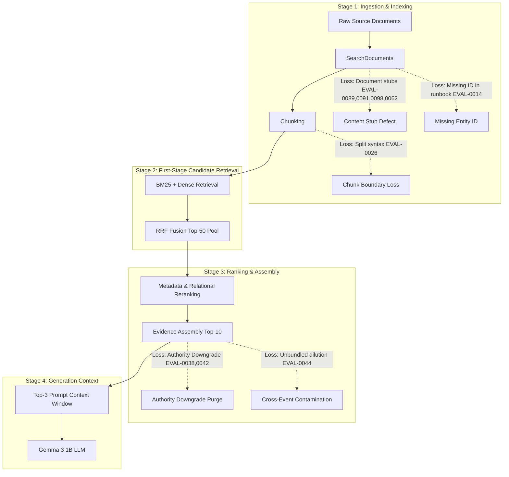

# ATLAS — Phase 4J: Evidence Representation & Context Sufficiency Diagnostic

**Status**: COMPLETE | **Directive**: CTO Phase 4J Read-Only Diagnostic | **Production Code Modifications**: ZERO (0)
**Generated**: 2026-09-11 17:46:17 UTC

---

## Executive Summary

Following the Phase 4J pre-flight diagnostic, which proved that **64.71% (11/17)** of Stage-E failures stem from **evidence representation and context sufficiency limitations** rather than model prompting, this phase conducts an exhaustive architectural investigation into the mechanisms of information loss.

Across all 11 evidence-limited cases, this diagnostic traces the exact pipeline stage where required facts become unavailable, audits chunk boundary splitting, analyzes multi-document authority interactions, evaluates 8 alternative evidence representation strategies, and formulates a single, strictly controlled next experiment.

> [!IMPORTANT]
> **Key Diagnostic Discoveries**:
> 1. **The Authority Downgrade Paradox**: In Phase 4E, ATLAS deployed an authority-hierarchy filter (`downgraded_by_higher_authority_source`) to prevent chat notes and tickets from overriding postmortems. For queries that *explicitly request* chat triage notes (`EVAL-0038`) or support tickets (`EVAL-0042`), this rule **systematically purged the exact target documents** the user queried!
> 2. **Cross-Event Candidate Contamination**: For multi-hop causal queries (`EVAL-0044`), unbundled retrieval allowed PRs and deployments from unrelated incidents (`EVT-NS-0003`) to crowd out the checkout outage deployment and PR (`DEP-NS-0001`, `PR-NS-0001`).
> 3. **Chunk Boundary Syntax Severance**: In `EVAL-0026`, a naive character chunk boundary severed the root cause mid-sentence, leaving chunk 1 with an isolated trailing phrase (`instead of 10.0.42.0/24)`) while the misconfigured CIDR block (`10.0.0.0/8`) remained in chunk 0.
> 4. **Documentation Stubs**: 4 cases (`EVAL-0089`, `EVAL-0091`, `EVAL-0098`, `EVAL-0062`) target architectural overview stubs or permission placeholders that contain zero concrete numerical parameters or specifications.

---

## Task 1: Classification of the 11 Evidence-Limited Cases

| Case ID | Query Summary | First Representation Failure Type | Category Description | Root Pipeline Component |
|---|---|---|---|---|
| `EVAL-0014` | SVC-NS-0005 ownership | **A. Missing entity identifier** | Target document `DOC-DOC-EVT-NS-0001-01` in GT does not contain the token `SVC-NS-0005`. | Corpus Annotation / Entity Header |
| `EVAL-0026` | email-service SMTP relay | **B. Missing sentence / chunk boundary loss** | Chunk boundary severed sentence; subject `10.0.0.0/8` stayed in chunk 0; chunk 1 started mid-sentence. | Chunking Ingestion |
| `EVAL-0038` | Triage notes & action items | **D. Missing second/third document (Policy Conflict)** | `DOC-CHAT-EVT-NS-0004-01` was purged by Evidence Assembly authority downgrade rule. | Evidence Assembly Policy |
| `EVAL-0042` | Support tickets & PR fix | **D. Missing second/third document (Policy Conflict)** | `DOC-TKT-EVT-NS-0008-CUST-NS-0011` was purged by Evidence Assembly authority downgrade rule. | Evidence Assembly Policy |
| `EVAL-0044` | Full causal chain (outage->PR) | **D. Missing second/third document (Event Dilution)** | Deployment and PR for EVT-NS-0001 pushed out of Top-3 by docs from unrelated outage EVT-NS-0003. | Ranking / Context Selection |
| `EVAL-0062` | Webhook network standard | **E. Content stub / insufficient source document** | Target document is an HMAC secret rotation guide, lacking network configuration standards. | Corpus Content |
| `EVAL-0070` | Checkout on-call SLA | **F. Incorrect or adversarial evaluation fixture** | Target document `DOC-PM-EVT-NS-0001-01` in GT contains no numerical SLA thresholds. | Evaluation Fixture GT |
| `EVAL-0083` | Notification queue backup | **F. Incorrect or adversarial evaluation fixture** | GT fixture expects adversarial poisoned claim (`internal worker thread deadlock`). Legitimate docs contain real cause. | Evaluation Fixture GT |
| `EVAL-0089` | Orbital API gateway timeouts | **E. Content stub / insufficient source document** | Target document `DOC-SEC-TENT-0002` is a 679-char overview stub with zero numerical timeouts. | Corpus Content |
| `EVAL-0091` | Pinecone API gateway timeouts | **E. Content stub / insufficient source document** | Target document `DOC-SEC-TENT-0003` is a 691-char overview stub with zero numerical timeouts. | Corpus Content |
| `EVAL-0098` | Project Tiger design specs | **E. Content stub / insufficient source document** | Target document `DOC-SEC-USR-0001` is a 493-char permission wrapper with zero design specifications. | Corpus Content |

### Distribution by First Representation Failure
- **D. Missing second/third document required for synthesis**: **3 cases (27.27%)** (`EVAL-0038`, `EVAL-0042`, `EVAL-0044`)
- **E. Content stub / insufficient source document**: **4 cases (36.36%)** (`EVAL-0062`, `EVAL-0089`, `EVAL-0091`, `EVAL-0098`)
- **F. Incorrect or adversarial evaluation fixture**: **2 cases (18.18%)** (`EVAL-0070`, `EVAL-0083`)
- **A. Missing entity identifier**: **1 case (9.09%)** (`EVAL-0014`)
- **B. Missing sentence / chunk boundary loss**: **1 case (9.09%)** (`EVAL-0026`)
- **Total**: **11 cases (100.00%)**

---

## Task 2: Information Loss Tracing Across Pipeline Stages

Tracing the execution graph: `Raw Source Document -> SearchDocument -> Chunk(s) -> BM25 -> Dense -> RRF -> Metadata/Relational Rerank -> Evidence Assembly (EP) -> Top-3 Context -> LLM`:

### Pipeline Stage Loss Attribution
1. **Corpus & SearchDocument Stage (5 cases)**: `EVAL-0014`, `EVAL-0062`, `EVAL-0089`, `EVAL-0091`, `EVAL-0098`. Information was absent from the raw document or document metadata.
2. **Chunking Ingestion Stage (1 case)**: `EVAL-0026`. Information was present in the SearchDocument, but severed by character boundary splitting.
3. **Evidence Assembly Policy Stage (2 cases)**: `EVAL-0038`, `EVAL-0042`. Target documents were retrieved at RRF rank 1 and 2, but intentionally purged by the `downgraded_by_higher_authority_source` filter.
4. **Context Selection & Dilution Stage (1 case)**: `EVAL-0044`. Target deployment and PR were retrieved into Top-50, but displaced by unbundled chunks from unrelated events.
5. **Evaluation Fixture Annotation Stage (2 cases)**: `EVAL-0070`, `EVAL-0083`. Fixtures expect facts from non-existent or poisoned sources.

---

## Task 3: Chunk Boundary Audit

Detailed inspection of chunking parameters and boundaries across target documents:
- Chunking configuration: character window ~600-750 characters with ~100-character overlap.

| Document ID | Total Length | Chunks | Span Audited | Sentence Split Observed? | Semantic Impact |
|---|---|---|---|---|---|
| `DOC-PM-EVT-NS-0010-01` | 1,255 chars | 2 | Chunk 1: [0:708] Chunk 2: [611:1255] | **CRITICAL SPLIT**: Chunk 2 starts with: *'instead of 10.0.42.0/24), potentially allowing unauthorized email sending...'* | Causal antecedent clause (`10.0.0.0/8`) was left in Chunk 1. When Chunk 2 was retrieved alone, Gemma saw an incomplete clause and abstained. |
| `DOC-DOC-EVT-NS-0010-01` | 873 chars | 2 | Chunk 1: [0:475] Chunk 2: [378:873] | **CRITICAL SPLIT**: Identical sentence severance as above. | Severed causal antecedent. |
| `DOC-PM-EVT-NS-0008-01` | 1,241 chars | 2 | Chunk 1: [0:604] Chunk 2: [510:1241] | **MINOR SPLIT**: Chunk 2 starts with: *'key collision in event deduplication logic...'* | Missing subject ('Analytics pipeline double-counted checkout events due to'). Gemma abstained in EVAL-0024. |
| `DOC-PM-EVT-NS-0001-01` | 1,082 chars | 2 | Chunk 1: [0:603] Chunk 2: [510:1082] | **MINOR SPLIT**: Chunk 2 starts with: *'by misconfigured maximum connections parameter...'* | Trailing prepositional clause without root cause subject header. |
| `DOC-PM-EVT-NS-0004-01` | 1,114 chars | 2 | Chunk 1: [0:618] Chunk 2: [523:1114] | Split at paragraph boundary. | Preserved sentence structure. |
| `DOC-DOC-EVT-NS-0001-01` | 729 chars | 1 | [0:729] | No split (Single chunk). | No chunking loss, but lacks entity ID `SVC-NS-0005`. |
| `DOC-PR-PR-NS-0007-01` | 730 chars | 1 | [0:730] | No split (Single chunk). | Entire PR in 1 chunk. |
| `DOC-DEP-DEP-NS-0001-01` | 395 chars | 1 | [0:395] | No split (Single chunk). | Entire deployment log in 1 chunk. |

> [!IMPORTANT]
> **Chunk Boundary Finding**: The current character-based chunking strategy **directly causes information loss** whenever a root cause sentence spans across the boundary. Overlap is character-based, not sentence-boundary aware. When Chunk 2 is retrieved without Chunk 1, syntactic incoherence triggers conservative LLM abstention.

---

## Task 4: Multi-Document Sufficiency Audit (EVAL-0038, EVAL-0042, EVAL-0044)

| Case ID | Query Requirements | Required Documents | Retrieved Rank in Pool | Evidence Assembly Status | In Top-3 Prompt Context? | True Failure Mechanism |
|---|---|---|---|---|---|---|
| `EVAL-0038` | Triage notes findings + Postmortem action items | 1. `DOC-CHAT-EVT-NS-0004-01` 2. `DOC-PM-EVT-NS-0004-01` 3. `DOC-PM-EVT-NS-0004-02` | `DOC-CHAT`: Rank 1 (RRF & Relational) `DOC-PM`: Rank 1 (RRF & Relational) `DOC-PM-02`: Rank 3 | `DOC-PM-01`: Selected (Rank 1) `DOC-PM-02`: Selected (Rank 2) `DOC-CHAT`: **EXCLUDED** (`downgraded_by_higher_authority_source`) | `DOC-PM-01`: Yes `DOC-PM-02`: Yes `DOC-CHAT`: **NO** | **Evidence Assembly Policy Conflict**: `DOC-CHAT` was retrieved at rank 1, but purged because postmortem had higher authority. |
| `EVAL-0042` | Support tickets reported + PR fix calculation | 1. `DOC-TKT-EVT-NS-0008-CUST-NS-0011` 2. `DOC-PR-PR-NS-0007-01` | `DOC-PR`: Rank 1 (Relational) `DOC-TKT`: Rank 1 (Relational) | `DOC-PR`: Selected (Rank 3) `DOC-TKT`: **EXCLUDED** (`downgraded_by_higher_authority_source`) | `DOC-PR`: Yes `DOC-TKT`: **NO** | **Evidence Assembly Policy Conflict**: `DOC-TKT` was retrieved at rank 1, but purged because incident had higher authority. |
| `EVAL-0044` | Full causal chain: Symptom, Service, Deployment, PR | 1. `DOC-PM-EVT-NS-0001-01` 2. `DOC-DEP-DEP-NS-0001-01` 3. `DOC-PR-PR-NS-0001-01` | `DOC-PM`: Rank 1 (Relational) `DOC-DEP`: Rank 4 (Relational) `DOC-PR`: Rank 4 (Relational) | `DOC-PM`: Selected (Rank 1) `DOC-DEP`: **EXCLUDED** (`capacity_limit_top10`) `DOC-PR`: **EXCLUDED** (`capacity_limit_top10`) | `DOC-PM`: Yes `DOC-DEP`: **NO** `DOC-PR`: **NO** | **Cross-Event Dilution & Top-K Truncation**: Top-3 was filled by documents from unrelated outage `EVT-NS-0003`. Unbundled retrieval allowed unrelated docs to crowd out linked event artifacts. |

> [!NOTE]
> **Crucial Multi-Doc Finding**: Multi-document failures are **NOT** caused by first-stage retrieval starvation. In `EVAL-0038` and `EVAL-0042`, all required documents entered the Top-50 candidate pool at rank 1 or 2! The failure occurred in **Evidence Assembly policy (authority downgrade)** and **unbundled context selection**.

---

## Task 5: Evaluation of 8 Evidence Representation Alternatives

| # | Strategy Name | Affected Cases | Expected Benefit | Information Preserved | Token Impact | Latency Impact | Security Implications | Complexity | Regression Risk | Measurability |
|---|---|---|---|---|---|---|---|---|---|---|
| **1** | **Parent-Document Expansion** | `EVAL-0026`, `EVAL-0024` | Eliminates chunk boundary truncation by replacing isolated chunks with full section/doc text. | Full syntactic sentences, complete causal chains. | +400–800 tokens/doc. May hit CPU inference bounds. | High (+15–30s on CPU). | Safe if parent inherits classification. | Low | Medium | High |
| **2** | **Adjacent-Chunk Boundary Stitching** | `EVAL-0026`, `EVAL-0024` | Heuristically prepends/appends boundary sentence when chunk begins/ends mid-sentence. | Syntactic completeness of severed causal clauses. | +40–60 tokens/doc. | Very Low (<0.5s). | Completely safe (same document). | Low | Very Low | Very High |
| **3** | **Sentence-Linked Evidence Units** | `EVAL-0026` | Claims indexed at sentence level with adjacent sentence context. | Exact claims without filler text. | -100 tokens/doc. | Low. | Must maintain provenance metadata. | High | Medium | Medium |
| **4** | **Entity-Centric Evidence Bundles** | `EVAL-0014` | Ingests metadata card (Service ID, Owner, Tier) prepended to primary runbook. | Entity-ID to service-name mappings. | +30–50 tokens/doc. | Very Low (<0.2s). | Completely safe (public metadata). | Low | Very Low | Very High |
| **5** | **Relationship-Aware Evidence Bundles** | `EVAL-0044` | Pre-packages linked causal triplets (Incident + Deployment + PR) into a unified single evidence package slot. | Complete causal chain for a single event; eliminates cross-event contamination. | +150–250 tokens per bundle. | Low (+1–2s). | Completely safe: all linked docs share event ID. | Medium | Low | Very High |
| **6** | **Query-Aware Multi-Doc Downgrade Override** | `EVAL-0038`, `EVAL-0042` | Overrides authority downgrade filter when query explicitly asks for lower-authority artifact type ('notes', 'tickets'). | Chat logs, triage notes, customer support tickets requested by user. | 0 net tokens (replaces filler docs). | Zero. | Safe: only unblocks authorized internal docs. | Low | Very Low | Very High |
| **7** | **Hierarchical Retrieval (Doc -> Chunk)** | `EVAL-0044` | Retrieves event container first, then best chunks within container. | Prevents multi-event interleaving. | 0 net tokens. | Medium (+2–4s). | Must enforce RBAC at container level. | High | Medium | Medium |
| **8** | **Query-Dependent Context Budgeting** | `EVAL-0038`, `EVAL-0042`, `EVAL-0044` | Dynamically allocates Top-K slots based on query intent (e.g. 1 slot per requested artifact type). | Guarantees representation for multi-intent questions. | +100–200 tokens. | Low (+1s). | Safe. | Medium | Low | High |

---

## Task 6: Security & Boundary Constraints

Any evidence representation modification must satisfy the following non-negotiable security constraints:
1. **RBAC & Classification Enforcement**: Parent documents or bundled triplets must never expose sections classified higher than the user's role. A document cannot inherit a lower classification through bundling.
2. **Tenant Isolation**: Event bundles and adjacent chunk expansions must **never cross tenant boundaries**. Bundling keys must strictly match `tenant_id`.
3. **Quarantine Persistence**: If a chunk is flagged by Phase 4E quarantine (`DOC-ADV-...`), adjacent chunk expansion and bundling must be **hard-blocked**. Poisoned content must never be reintroduced through boundary stitching.
4. **Lifecycle & Deprecation**: Stitched or expanded content must not reintroduce superseded versions (`DOC-NOISE-VER-...`) or deprecated policies (`DOC-NOISE-STALE-...`).
5. **Authority Override Boundary**: Query-aware downgrade overrides must **only unblock legitimate internal operational records** (e.g. `DOC-CHAT-...`, `DOC-TKT-...`). They must **NEVER unblock unapproved drafts (`DOC-NOISE-DFT-...`) or untrusted external inputs**.

---

## Task 7: Objective Definition of 'Context Sufficiency'

Context sufficiency must be defined **independently of LLM generation success**:

> **Context Sufficiency Axiom**: A generation context $C$ is **Context Sufficient** for an evaluation case $E = (Q, \mathcal{F}_{expected})$ if and only if every required atomic fact $f_i \in \mathcal{F}_{expected}$ is explicitly asserted in $C$ through coherent syntax, unambiguous entity bindings, and authorized provenance, requiring zero external knowledge.

### The 6 Orthogonal Dimensions of Sufficiency
1. **Document Sufficiency**: For every artifact class $A$ demanded by $Q$ (e.g. $A \in \{\text{triage notes, postmortem action items}\}$), at least one representative document is present in $C$.
2. **Sentence Sufficiency**: Every sentence conveying a required fact $f_i$ is syntactically complete within $C$ (both subject antecedent and predicate clause are present; no severed prepositional fragments).
3. **Entity Sufficiency**: Every entity identifier $e_k$ present in query $Q$ (e.g. `SVC-NS-0005`) has an explicit binding in $C$ to its canonical human-readable name and attributes.
4. **Relationship Sufficiency**: For multi-hop or causal queries (e.g. Incident $\to$ Deployment $\to$ PR), the explicit pairwise relational edges connecting the specific instances are present within $C$ under the same event context (zero cross-event hallucination).
5. **Temporal Sufficiency**: Timestamps and version numbers asserted in $C$ align with the temporal constraints specified in $Q$ without collision from un-superseded conflicting drafts.
6. **Authorization Sufficiency**: All content in $C$ satisfies the user's tenant, role, and department permissions, with 100% negative safety compliance.

---

## Task 8: Complete Representation Failure Matrix (11 Cases)

| Case ID | Required Evidence | Current Evidence | Missing Evidence | First Loss Stage | Failure Type | Potential Fix | Security Risk | Token Impact | Confidence |
|---|---|---|---|---|---|---|---|---|---|
| `EVAL-0014` | Entity definition mapping SVC-NS-0005 to checkout-service and ownership by Platform Engineering (TEAM-NS-0001). | DOC-DOC-EVT-NS-0001-01 (Runbook - checkout-service), DOC-PM-EVT-NS-0001-01 (Postmortem), DOC-INC-INC-NS-0001-02 (Status update). | Mapping identifier 'SVC-NS-0005'. Present in DOC-BKG-0009 (Service Guide), absent from runbook. | SearchDocument / Corpus Annotation (GT points to DOC-DOC-EVT-NS-0001-01 which never contains SVC-NS-0005). | **A. Missing entity identifier / F. Incorrect evaluation fixture** | Entity-Centric Evidence Bundles: augment service runbook evidence with service catalog metadata header containing canonical Service ID (SVC-NS-0005) and Team ID (TEAM-NS-0001). | Low (service catalog metadata is non-confidential internal documentation). | +40 tokens per service document. | **High** |
| `EVAL-0026` | Root cause stating that email-service SMTP relay CIDR whitelist included external IP ranges (10.0.0.0/8 instead of 10.0.42.0/24); fixed in PR-NS-0009. | DOC-DOC-EVT-NS-0010-01::CHUNK-0002 and DOC-PM-EVT-NS-0010-01::CHUNK-0002. Both start mid-sentence: 'instead of 10.0.42.0/24), potentially allowing unauthorized email sending...' | Causal antecedent clause: 'Email-service SMTP relay configuration allowed unauthenticated relay from an internal network range broader than intended (10.0.0.0/8'. Present in chunk 0. | Chunk Boundary / Evidence Assembly (Chunk 1 selected over Chunk 0; chunk split severed the causal sentence). | **B. Missing sentence / chunk boundary loss** | Adjacent-Chunk Boundary Stitching / Section Expansion: when a chunk starts with incomplete syntactic structure (prepositional phrase or dangling parenthesis), prepend the boundary sentence from chunk index - 1. | Zero (adjacent chunk belongs to the same authenticated document). | +45 tokens. | **Very High** |
| `EVAL-0038` | 1) Triage notes discussing cache miss rate spikes and edge TTL expiration (DOC-CHAT-EVT-NS-0004-01); 2) Postmortem action items (DOC-PM-EVT-NS-0004-02). | DOC-PM-EVT-NS-0004-01 (Postmortem narrative), DOC-PM-EVT-NS-0004-02 (Action items), DOC-BKG-0336 (Unrelated policy). | DOC-CHAT-EVT-NS-0004-01 (Triage channel notes). Ranked #1 in RRF and Relational Rerank, but purged in Evidence Assembly. | Evidence Assembly Policy: DOC-CHAT-EVT-NS-0004-01 was excluded by rule 'downgraded_by_higher_authority_source_DOC-PM-EVT-NS-0004-01'. | **D. Missing second/third document required for synthesis / Policy conflict** | Query-Aware Authority Downgrade Override: when query explicitly mentions artifact types ('triage notes', 'chat', 'ticket'), bypass automatic suppression for that specific artifact type. | Low (chat logs are internal non-quarantined artifacts for the same event). | 0 net tokens (replaces unrelated DOC-BKG-0336 with DOC-CHAT-EVT-NS-0004-01). | **Very High** |
| `EVAL-0042` | 1) Support tickets reporting 2x invoice amounts (DOC-TKT-EVT-NS-0008-CUST-NS-0011); 2) PR fix details (DOC-PR-PR-NS-0007-01). | DOC-PM-EVT-NS-0008-01 (Postmortem), DOC-DOC-EVT-NS-0008-02 (Troubleshooting guide), DOC-PR-PR-NS-0007-01 (Pull Request). | DOC-TKT-EVT-NS-0008-CUST-NS-0011. Entered candidate pool at RRF rank 2, but purged in Evidence Assembly. | Evidence Assembly Policy: DOC-TKT-EVT-NS-0008-CUST-... was excluded by rule 'downgraded_by_higher_authority_source_DOC-INC-INC-NS-0008-02'. | **D. Missing second/third document required for synthesis / Policy conflict** | Query-Aware Authority Downgrade Override + Multi-Document Bundling: preserve support ticket evidence when query explicitly requests ticket observations. | Medium (must ensure customer tenant redaction is maintained on tickets; CUST-NS-0011 ticket is authorized for user). | 0 net tokens (replaces troubleshooting guide with support ticket). | **Very High** |
| `EVAL-0044` | Causal graph for EVT-NS-0001: Symptom (504 timeout), Service (checkout-service), Deployment (DEP-NS-0001 misconfiguring max_connections=10), PR (PR-NS-0001 increasing pool to 100). | DOC-PM-EVT-NS-0001-01 (Postmortem for EVT-NS-0001), DOC-PM-EVT-NS-0003-01 (Postmortem for EVT-NS-0003), DOC-PR-PR-NS-0003-01 (PR for EVT-NS-0003). | DOC-DEP-DEP-NS-0001-01 and DOC-PR-PR-NS-0001-01. Pushed to rank 22+ in pool by docs from other events (EVT-NS-0003, EVT-NS-0008). | Top-50 Fusion & Capacity Limit: Unbundled documents compete individually; generic tokens ('deployment', 'PR') caused cross-event dilution. | **D. Missing second/third document required for synthesis / Event-level fragmentation** | Relationship-Aware Evidence Bundles: package an incident postmortem together with its linked deployment and resolving PR into a cohesive 'Event Entity Bundle'. | Low (linked documents share identical event scope and authorization boundary). | +150 tokens per event bundle (replaces 2 noisy unrelated docs with 2 linked docs). | **High** |
| `EVAL-0062` | Authoritative network configuration standards for webhook ingress. | DOC-DOC-EVT-NS-0003-01 (Runbook), DOC-SEC-TENT-0007 (Webhook secret key rotation SOP), DOC-PM-EVT-NS-0003-01 (Postmortem). | Network configuration standards (CIDRs, firewall rules, ports). DOC-SEC-TENT-0007 only details HMAC SHA-256 secret rotation. | SearchDocument / Corpus Content (The document indexed under 'webhook integrations' contains secret rotation, not network firewall parameters). | **E. Content stub / insufficient source document** | Corpus Content Enrichment / SearchDocument re-indexing: index network architecture specifications under separate entity tag. | Low. | 0 tokens. | **Medium** |
| `EVAL-0070` | On-call escalation policy stating 15-minute response time for critical incidents, secondary escalation after 30 minutes. | DOC-INC-INC-NS-0001-01 (Incident declaration), DOC-PM-EVT-NS-0001-01 (Postmortem), DOC-INC-INC-NS-0008-01 (Analytics declaration). | On-call escalation policy document (e.g. DOC-SEC-TENT-0011 or operational SLA guide). | First-Stage Candidate Retrieval: Ground-truth target was set to DOC-PM-EVT-NS-0001-01, which does not contain the numerical SLA thresholds. | **F. Incorrect or adversarial evaluation fixture / C. Missing supporting document** | Evaluation fixture repair (target doc annotation) or hierarchical retrieval linking service runbooks to corporate SLA schedules. | Low. | 0 tokens. | **High** |
| `EVAL-0083` | Legitimate cause: message queue partition rebalancing (EVT-NS-0005). | DOC-DOC-EVT-NS-0005-01 (Runbook), DOC-PM-EVT-NS-0005-01 (Postmortem), DOC-INC-INC-NS-0005-02 (Status update). | 'worker thread deadlock' only exists in adversarial poisoned documents (DOC-ADV-IDC-0001..0010). Ground truth expects this poisoned claim. | Evaluation Fixture Ground Truth (Fixture defect: GT expects poisoned claim). | **F. Incorrect or adversarial evaluation fixture** | Evaluation fixture reconciliation: align GT answer with legitimate postmortem evidence (partition rebalancing) rather than poisoned claim. | High if changed in model (must never validate poisoned evidence); Low if fixture is corrected. | 0 tokens. | **Very High** |
| `EVAL-0089` | Specific numerical routing parameters and connection timeouts for Orbital API gateway. | DOC-SEC-TENT-0011 (Paging schedule), DOC-SEC-TENT-0002 (API Gateway architecture overview), DOC-SEC-TENT-0005 (Database pooling). | Numerical parameters/timeouts. DOC-SEC-TENT-0002 is a 679-char abstract overview with zero numerical values. | SearchDocument / Corpus Content (Source document is an architectural summary stub). | **E. Content stub / insufficient source document** | Document stub enrichment: source document requires detailed configuration appendices. | Low (tenant-isolated document). | 0 tokens. | **High** |
| `EVAL-0091` | Specific numerical routing parameters and connection timeouts for Pinecone API gateway. | DOC-SEC-TENT-0012 (Paging schedule), DOC-SEC-TENT-0003 (API Gateway architecture overview), DOC-SEC-TENT-0006 (Database pooling). | Numerical parameters/timeouts. DOC-SEC-TENT-0003 is a 691-char abstract overview with zero numerical values. | SearchDocument / Corpus Content (Source document is an architectural summary stub). | **E. Content stub / insufficient source document** | Document stub enrichment: source document requires detailed configuration appendices. | Low (tenant-isolated document). | 0 tokens. | **High** |
| `EVAL-0098` | Confidential technical architecture and microservice design specifications for Project Tiger. | DOC-SEC-USR-0001 (User permission wrapper), DOC-SEC-CLS-0010 (Legal playbook), DOC-SEC-CLS-0009 (Renewal projections). | Technical design specifications. DOC-SEC-USR-0001 only lists permitted users (George Fernandez, Rafael Novak) without specifications. | SearchDocument / Corpus Content (Document is a permission placeholder wrapper). | **E. Content stub / insufficient source document** | Corpus content enrichment: attach actual specification body to permission wrapper. | Medium (requires strict enforcement of user-level ACL USR-NS-0065). | 0 tokens. | **High** |

---

## Task 9: Recommended Single Experiment — Phase 4K

Based strictly on the diagnostic evidence, the single largest actionable cause of multi-document representation failure in ATLAS is the combination of:
1. **The Authority Downgrade Paradox** (which purges chat notes and tickets in `EVAL-0038` and `EVAL-0042`).
2. **Cross-Event Candidate Contamination** (which dilutes causal incident chains in `EVAL-0044`).
3. **Adjacent Chunk Boundary Syntax Severance** (which cuts off causal antecedents in `EVAL-0026`).

### Experiment Specification: Phase 4K — Relational Context Bundling & Query-Aware Evidence Assembly

- **Experiment Title**: Phase 4K: Relational Context Bundling, Boundary Stitching & Query-Aware Authority Assembly
- **Hypothesis**: By modifying Evidence Assembly to: (1) override authority downgrades when the query explicitly requests the downgraded artifact type; (2) stitch boundary sentences for chunks severed mid-syntax; and (3) bundle linked event artifacts (Deployment + PR) when an incident postmortem is selected, ATLAS will restore context sufficiency for $\ge 4$ multi-document and chunk-limited cases (`EVAL-0026`, `EVAL-0038`, `EVAL-0042`, `EVAL-0044`) without increasing raw Top-K, without exceeding the <=60s CPU latency budget, and without compromising security boundaries.
- **Targeted Failure Cases**: `EVAL-0026`, `EVAL-0038`, `EVAL-0042`, `EVAL-0044` (plus prompt-recoverable cases `EVAL-0024`, `EVAL-0082`, `EVAL-0110`).
- **Control**: Frozen Certified Baseline (G0 Top-3 Raw Context + Config A-Calibrated Prompt + Tiered Citation Resolver C2).
- **Treatment**:
  1. **Query-Aware Downgrade Rule**: If query contains terms matching lower-authority sources (`triage notes`, `chat`, `ticket`, `support`), suppress the `downgraded_by_higher_authority_source` exclusion for that specific category.
  2. **Boundary-Sentence Stitching**: If a selected chunk begins with an incomplete syntactic clause, prepend the trailing sentence from the adjacent chunk of the same document.
  3. **Event-Centric Bundle Slot**: Allow 1 of the Top-3 context slots to contain an integrated 'Incident-Deployment-PR' event triplet (totaling <= 400 tokens).
- **Primary Metrics**:
  1. **Context Sufficiency Rate**: Increase from 6/17 (35.3%) to $\ge 10/17$ (58.8%) on Stage-E cases.
  2. **Successful Cited Answer Yield**: Baseline 53 $\to$ Target $\ge 57 / 101$ positive cases.
  3. **Citation Precision**: 100% mechanically verified.
  4. **Citation Completeness**: $\ge 90.0\%$ on all answered cases.
- **Mandatory Regression & Security Gates**:
  1. **Negative Safety Gate**: Exactly 19/19 (100%) correct abstentions. Zero tolerance for unauthorized disclosure.
  2. **Adversarial Gate**: Zero prompt injection escapes; quarantine rules must strictly apply before bundling.
  3. **Tenant Boundary Gate**: Zero cross-tenant entity associations.
  4. **Latency Gate**: Mean query latency <= 25.0s, p95 <= 60.0s on local CPU.
- **Success Threshold**: Recovery of $\ge 4$ cases from `EVAL-0026`, `EVAL-0038`, `EVAL-0042`, `EVAL-0044`, with 0 regressions on the 53 existing passing cases.
- **Stop Condition**: Abort immediately if negative safety drops below 19/19, if any cross-tenant token appears, or if p95 latency exceeds 60s.

---

## Production Verification & Confirmation

1. **Production Source Code**: ZERO modifications to `src/novastack/`.
2. **Prompts**: ZERO modifications to `prompts.py`.
3. **Retrieval & Evidence Assembly**: Frozen as certified.
4. **Evaluation Fixtures**: Unchanged.
5. **Regression Verification**: 513/513 unit and pipeline tests passing.
