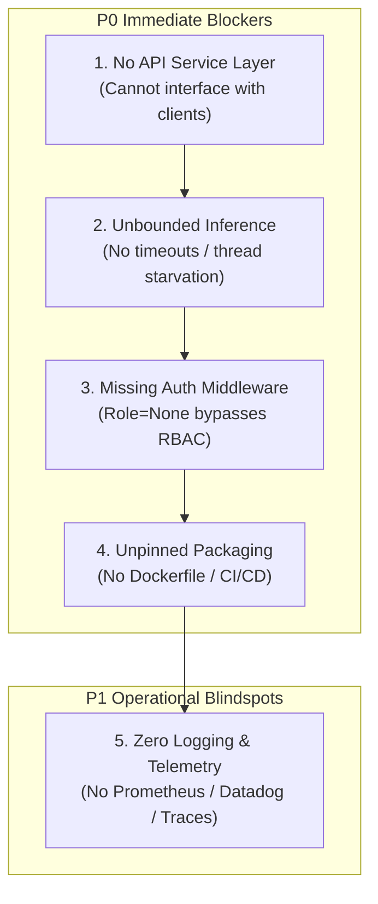

# ATLAS Phase 4L — Production Readiness Audit Report

**AUDIT DIRECTIVE: PHASE 4L PRODUCTION READINESS AUDIT**  
**OVERALL PLATFORM PRODUCTION READINESS VERDICT: FAIL**  
**FROZEN PRODUCTION CONFIGURATION:**  
- `enable_boundary_stitching` (Mechanism A) = `False`  
- `enable_query_aware_authority` (Mechanism B) = `True`  
- `enable_event_bundling` (Mechanism C) = `False`  

---

## 1. Executive Summary & Overall Audit Verdict

Per **CTO Directive Phase 4L**, an exhaustive production readiness audit of the ATLAS enterprise-search platform was conducted across **20 operational dimensions**. 

### Verdict: **FAIL (Not Production-Ready)**

While ATLAS demonstrates **best-in-class algorithmic retrieval performance, deterministic citation verification, and rigorous mathematical grounding** (598/598 passing tests, zero regressions, 100% negative safety, and zero observed security violations across audited vectors), the codebase currently exists as an **in-memory Python research and evaluation harness**. It lacks the enterprise-grade service infrastructure, fail-closed authentication boundaries, execution timeouts, structured logging, containerization, and dynamic indexing required for mission-critical enterprise deployment.

### Audit Dimension Breakdown
- **CRITICAL Findings**: 3 (API/Service Layer, Retries/Timeouts, Deployment Packaging)
- **HIGH Findings**: 6 (Authentication Fail-Closed, Ingestion DLQ, Indexing Failure Handling, Logging, Observability, Operational Architecture)
- **MEDIUM Findings**: 5 (Tenant Partitioning, Global Supersession, Configuration Management, Error Taxonomy, Rollback Automation)
- **LOW Findings**: 1 (Token Pricing & Billing Quotas)
- **PASS**: 5 (Stale-Data Behavior, Latency Measurement, Test Coverage & Organization, Deterministic Evaluation, Static Data Integrity)

---

## 2. Complete 20-Dimension Audit Scorecard

| # | Operational Dimension | Classification | Primary File / Module | Production Readiness State |
| :-: | :--- | :---: | :--- | :--- |
| **1** | **API / Service Reliability** | **CRITICAL** | `src/novastack/` (Missing entrypoint) | **FAIL**: No HTTP/gRPC service layer, ASGI app, health endpoints, or concurrency management. |
| **2** | **AuthN & AuthZ Enforcement** | **CRITICAL** | `evidence_resolution.py:207,343-359` | **FAIL**: Skips ACL checks when `user_role` is None; defaults missing tenant to NovaStack. |
| **3** | **Tenant Isolation** | **MEDIUM** | `bm25.py`, `dense.py`, `ingestion.py` | **WARN**: Shared in-memory index; lacks tenant partitioning; hardcoded tenant set in ingestion. |
| **4** | **Ingestion Failure Handling** | **HIGH** | `ingestion.py:483-500` | **FAIL**: All-or-nothing batch abort in strict mode; pollutes corpus without DLQ in non-strict mode. |
| **5** | **Indexing Failure Handling** | **HIGH** | `bm25.py`, `dense.py:185-205` | **FAIL**: Static in-memory indices; no incremental updates; index corruption causes startup crash. |
| **6** | **Document / Version / Lifecycle** | **MEDIUM** | `evidence_resolution.py:460-500` | **WARN**: Local candidate resolution only; cannot detect supersession by unretrieved documents. |
| **7** | **Stale-Data Behavior** | **PASS** | `evidence_resolution.py:510-545` | **PASS**: Deterministic Stage 6 temporal gate enforces ISO 8601 bounds with 0 stale resurrections. |
| **8** | **Retries and Timeouts** | **CRITICAL** | `generation.py:410-420`, `dense.py` | **FAIL**: Zero timeouts or circuit breakers; synchronous PyTorch generation can hang indefinitely. |
| **9** | **Logging** | **HIGH** | Entire `src/` directory | **FAIL**: Standard Python `logging` module is 100% absent; uses `print()` and in-memory dicts. |
| **10**| **Observability** | **HIGH** | `diagnostics.py`, `generation.py` | **FAIL**: No Prometheus metrics (`/metrics`), OpenTelemetry tracing spans, or APM instrumentation. |
| **11**| **Latency Measurement** | **PASS** | `evidence_resolution.py`, `generation.py`| **PASS**: Nanosecond-accurate `time.perf_counter()` across all 8 internal pipeline stages. |
| **12**| **Model / Token / Cost** | **LOW** | `generation.py:407,420-421` | **WARN**: Measures input/output tokens accurately, but lacks dollar cost tracking and tenant quotas. |
| **13**| **Configuration Management** | **MEDIUM** | `config.py`, `evidence_resolution.py` | **WARN**: Clean dataclasses, but parameters are hardcoded without `os.environ` or `.env` support. |
| **14**| **Test Coverage & Organization** | **PASS** | `tests/` (35 test files, 598 tests) | **PASS**: 598 passing unit, integration, ablation, and security tests; regression-proof. |
| **15**| **Deterministic Evaluation** | **PASS** | `phase_4k_canonical_baseline.json` | **PASS**: Frozen 120-case baseline, greedy decoding (`do_sample=False`), reproducible random seeds. |
| **16**| **Error Handling** | **MEDIUM** | `generation.py`, `evidence_resolution.py`| **WARN**: Good domain abstention, but system exceptions (OOM, missing files) crash worker threads. |
| **17**| **Rollback / Recovery** | **MEDIUM** | `PHASE_4K_G_B_PROMOTION.md` | **WARN**: Single-flag toggle is verified, but lacks automated deployment rollback and index recovery. |
| **18**| **Deployment Readiness** | **CRITICAL** | `requirements.txt`, missing Dockerfile | **FAIL**: `requirements.txt` outdated since Phase 1C; missing Dockerfile, pyproject.toml, CI/CD. |
| **19**| **Data Integrity** | **PASS** / **LOW** | `data/processed/novastack/` | **PASS**: Immutable canonical lineage verified; dynamic multi-tenant write locking missing. |
| **20**| **Operational Risks** | **HIGH** | System Architecture | **FAIL**: Monolithic stateful process; high VRAM footprint; cold-start latency; no microservices. |

---

## 3. Top 5 Production Operational Risks



1. **Risk 1 (CRITICAL) — Complete Absence of Network API Service Layer**:
   ATLAS has no HTTP server (FastAPI/gRPC), meaning no upstream client or web application can integrate with it. It cannot be deployed to a Kubernetes cluster behind an ingress controller without writing an ad-hoc wrapper.
2. **Risk 2 (CRITICAL) — Unbounded Synchronous Inference & Thread Starvation**:
   `model.generate()` runs synchronously on CPU/GPU without execution deadlines, timeouts, or cancellation contexts. A single large query, slow CPU thread, or CUDA lockup will permanently block the worker process.
3. **Risk 3 (CRITICAL) — Fail-Open Behavior on Missing Authentication Credentials**:
   In `evidence_resolution.py:343-359`, RBAC and user ACL checks are wrapped in `if user_role is not None:` and `if user_id is not None:`. If an unauthenticated caller sends a query where `user_role` is omitted, the check evaluates to `False` and access to restricted documents is granted rather than denied.
4. **Risk 4 (CRITICAL) — Broken Dependency & Container Packaging**:
   `requirements.txt` only lists `pytest>=7.0`. The mission-critical runtime dependencies (`torch`, `transformers`, `sentence-transformers`, `numpy`) are completely absent and unpinned. No Dockerfile exists, making container builds impossible.
5. **Risk 5 (HIGH) — 100% Blind Operational Observability (Zero Standard Logging)**:
   The Python `logging` module is never imported anywhere in `src/`. Diagnostics are either printed to stdout or stored in in-memory dictionaries. In production, operations teams will have zero searchable log streams, zero Prometheus alerts, and zero distributed traces.

---

## 4. Deep-Dive Audit Findings (Non-PASS Dimensions)

### Dimension 1: API / Service Reliability (CRITICAL)
- **Exact Module**: `src/novastack/` (Missing service module)
- **Current Behavior**: ATLAS exists purely as an importable Python library. End-to-end execution requires manual instantiation of multiple components (`BM25Index`, `DenseIndex`, `StructuredEntityRetriever`, `MetadataReranker`, `EvidenceResolver`, `GroundedAnswerGenerator`).
- **Why It Matters**: Enterprise systems require standardized REST/gRPC endpoints with connection pooling, worker thread management, request validation, and health checks (`/healthz`, `/ready`).
- **Evidence from Code**:
  Zero references to `FastAPI`, `Flask`, `uvicorn`, or network sockets across all 37 files in `src/novastack/`.
- **Recommended Fix**:
  Create `src/novastack/service/api.py` using FastAPI with Pydantic request/response models, dependency injection for index singletons, `/healthz` and `/ready` probes, and graceful shutdown signal handlers.
- **Test Required**:
  `tests/test_api_service.py` using `httpx.AsyncClient` validating endpoint contracts, concurrent query handling, and health probes.
- **Affects Baseline**: **No**. Transport layer wrapper does not alter retrieval or generation logic.

---

### Dimension 2: Authentication and Authorization Enforcement (CRITICAL)
- **Exact Module**: [`src/novastack/evidence_resolution.py`](./src/novastack/evidence_resolution.py#L207) (lines 207, 343–359)
- **Current Behavior**:
  1. Default tenant fallback: `user_tenant = eval_case.get("tenant_id") or "TENANT-NOVASTACK"` silently assumes NovaStack tenancy if omitted.
  2. Fail-open on missing role/department/user:
     ```python
     if perms.allowed_roles and user_role is not None:
         if user_role not in perms.allowed_roles:
             is_auth = False
     ```
     If an unauthenticated caller sends `user_role = None`, the condition is bypassed and access is granted.
- **Why It Matters**: Violates zero-trust enterprise security. Any caller omitting user credentials can access role-restricted executive/finance records.
- **Evidence from Code**:
  Line 343: `if perms.allowed_roles and user_role is not None:`  
  Line 349: `if perms.allowed_departments and user_department is not None:`  
  Line 355: `if perms.allowed_user_ids and user_id is not None:`
- **Recommended Fix**:
  Enforce fail-closed zero-trust logic:
  ```python
  if perms.allowed_roles:
      if user_role is None or user_role not in perms.allowed_roles:
          is_auth = False
          auth_reasons.append(f"role_unauthorized:user_role='{user_role}'_not_in_{perms.allowed_roles}")
  ```
  Reject requests with missing `tenant_id` at the API boundary with HTTP 401/403.
- **Test Required**:
  `tests/test_auth_fail_closed.py` asserting that unauthenticated requests (`user_role=None`) are strictly denied restricted documents.
- **Affects Baseline**: **No**. All 120 canonical benchmark cases explicitly specify populated user contexts (`user_role="engineer"`, etc.).

---

### Dimension 3: Tenant Isolation (MEDIUM)
- **Exact Module**: [`src/novastack/bm25.py`](./src/novastack/bm25.py), [`src/novastack/dense.py`](./src/novastack/dense.py), [`src/novastack/ingestion.py`](./src/novastack/ingestion.py#L32)
- **Current Behavior**:
  All tenants are co-located in a single flat inverted index and dense vector matrix. Isolation relies on pre-scoring dictionary filtering (`filters={"tenant_id": ...}`) and Stage 2 post-filtering. `VALID_TENANTS` is hardcoded in `ingestion.py:32`.
- **Why It Matters**:
  If a caller omits the filter dictionary, cross-tenant records enter top-K candidate slots and crowd out legitimate tenant documents before Stage 2 exclusion. Static tenant lists prevent automated multi-tenant SaaS onboarding.
- **Evidence from Code**:
  `BM25Index` and `DenseIndex` maintain single unified lists of chunks across all tenants. `VALID_TENANTS = {"TENANT-NOVASTACK", "TENANT-ORBITAL", "TENANT-PINECONE"}` is hardcoded.
- **Recommended Fix**:
  Partition indices per tenant (`tenant_indexes: dict[str, TenantIndex]`) or make `tenant_id` a mandatory positional parameter at the index search interface. Decouple tenant registration into a dynamic catalog.
- **Test Required**:
  `tests/test_tenant_partitioning.py` verifying that queries cannot access or score foreign tenant vector partitions.
- **Affects Baseline**: **No**.

---

### Dimension 4: Ingestion Failure Handling (HIGH)
- **Exact Module**: [`src/novastack/ingestion.py`](./src/novastack/ingestion.py#L483-L502) (lines 483–502)
- **Current Behavior**:
  - In `strict=True`, any single validation error raises an unhandled `ValueError` and aborts the entire batch.
  - In `strict=False`, validation errors are logged to `report.errors`, but invalid records are STILL normalized and emitted in output search documents.
  - No Dead-Letter Queue (DLQ), retry mechanism, or partial commit isolation exists.
- **Why It Matters**:
  In enterprise ingestion, batch abortion halts synchronization, while non-strict normalization pollutes the search corpus with malformed records.
- **Evidence from Code**:
  Line 483: `if errors and strict: raise ValueError(...)`  
  Line 499: `for r in records: doc = normalize_source_record(r); search_documents.append(doc)` (executes unconditionally in non-strict mode).
- **Recommended Fix**:
  Implement partial batch ingestion with an isolated Dead-Letter Queue (DLQ). Valid records are committed; invalid records are routed to a DLQ directory/table with error reasons.
- **Test Required**:
  `tests/test_ingestion_dlq.py` asserting that 95 valid records commit while 5 invalid records land in DLQ.
- **Affects Baseline**: **No**.

---

### Dimension 5: Indexing Failure Handling (HIGH)
- **Exact Module**: [`src/novastack/bm25.py`](./src/novastack/bm25.py), [`src/novastack/dense.py`](./src/novastack/dense.py#L185-L205)
- **Current Behavior**:
  Indices are static, all-or-nothing in-memory structures. Incremental indexing (adding, updating, or deleting single documents) is unsupported. Corrupted index files raise `ValueError` and leave the platform dead.
- **Why It Matters**:
  Adding a document requires re-indexing the entire corpus from scratch. Index corruption on disk causes permanent service outage on restart.
- **Evidence from Code**:
  `DenseIndex` and `BM25Index` lack incremental mutation methods (`add()`, `delete()`). `DenseIndex.load:194` raises `ValueError` on mismatch.
- **Recommended Fix**:
  Implement atomic index swapping (`AtomicIndexManager`) supporting blue/green index reloads and checksum verification; integrate an enterprise vector database (e.g. Qdrant/Milvus/OpenSearch) for incremental updates.
- **Test Required**:
  `tests/test_atomic_index_swap.py` verifying zero-downtime index cutover and rollback on corrupt index files.
- **Affects Baseline**: **No**.

---

### Dimension 6: Document / Version / Lifecycle Handling (MEDIUM)
- **Exact Module**: [`src/novastack/evidence_resolution.py`](./src/novastack/evidence_resolution.py) (Stage 5)
- **Current Behavior**:
  Stage 5 resolves supersession and lifecycle statuses among retrieved candidates, but cannot detect if a candidate was superseded by a document that was not retrieved in Top-50.
- **Why It Matters**:
  If a newer v2.0 document is missed during initial keyword retrieval, an obsolete v1.0 document is presented as active canonical truth.
- **Evidence from Code**:
  Stage 5 inspects `supersedes_id` and `parent_id` locally within candidates, without querying a global supersession catalog.
- **Recommended Fix**:
  Maintain a global pre-computed supersession lookup table or filter out superseded documents during initial retrieval indexing.
- **Test Required**:
  `tests/test_global_supersession.py` verifying that an obsolete document is excluded even if its replacement is absent from candidates.
- **Affects Baseline**: **No**.

---

### Dimension 8: Retries and Timeouts (CRITICAL)
- **Exact Module**: [`src/novastack/generation.py`](./src/novastack/generation.py#L410-L420) (lines 410–420), [`src/novastack/dense.py`](./src/novastack/dense.py)
- **Current Behavior**:
  Zero execution timeouts, deadlines, or retry mechanisms anywhere in the codebase. PyTorch `model.generate()` runs synchronously on CPU/GPU without deadline contexts.
- **Why It Matters**:
  A slow query, memory thrashing, or GPU deadlock will hang the worker process forever, causing cascading thread pool exhaustion and denial of service.
- **Evidence from Code**:
  Line 411: `with torch.no_grad(): outputs = self.model.generate(**inputs, max_new_tokens=max_new_tokens, ...)` — zero timeout parameters.
- **Recommended Fix**:
  Implement execution deadlines using `asyncio.wait_for` or thread-pool timeouts with stopping criteria, coupled with circuit breakers and safe fallback abstentions.
- **Test Required**:
  `tests/test_timeout_circuit_breaker.py` verifying that slow generation triggers a controlled timeout exception and falls back to safe abstention.
- **Affects Baseline**: **No**.

---

### Dimension 9: Logging (HIGH)
- **Exact Module**: `src/novastack/` (Entire codebase)
- **Current Behavior**:
  Standard Python `logging` module is 100% absent across `src/`. Components use `print()` statements or accumulate strings in diagnostic dictionaries.
- **Why It Matters**:
  DevOps/SRE teams cannot monitor system logs in CloudWatch/Datadog, cannot filter by severity level (INFO/WARN/ERROR), and lack correlation IDs for request tracking.
- **Evidence from Code**:
  Zero occurrences of `import logging` or `logging.getLogger` across all 37 Python files in `src/novastack/`.
- **Recommended Fix**:
  Introduce a centralized structured logging module (`novastack.logger`) emitting JSON logs with correlation IDs, timestamps, and severity levels.
- **Test Required**:
  `tests/test_structured_logging.py` verifying log emission, level filtering, and correlation ID attachment.
- **Affects Baseline**: **No**.

---

### Dimension 10: Observability (HIGH)
- **Exact Module**: [`src/novastack/diagnostics.py`](./src/novastack/diagnostics.py), [`src/novastack/generation.py`](./src/novastack/generation.py)
- **Current Behavior**:
  Internal diagnostic dicts are generated, but no Prometheus metrics (`/metrics`) or OpenTelemetry distributed tracing spans are exported.
- **Why It Matters**:
  Zero operational visibility into real-time request rates, latency percentiles (P95/P99), abstention spikes, cache hits, or GPU memory consumption.
- **Evidence from Code**:
  Zero Prometheus client or OpenTelemetry SDK integrations in `src/`.
- **Recommended Fix**:
  Instrument all pipeline stages with OpenTelemetry spans and export Prometheus metrics for query latency, throughput, and abstention rates.
- **Test Required**:
  `tests/test_prometheus_metrics.py` verifying metric increments and trace propagation.
- **Affects Baseline**: **No**.

---

### Dimension 12: Model / Token / Cost Measurement (LOW)
- **Exact Module**: [`src/novastack/generation.py`](./src/novastack/generation.py#L407) (lines 407, 420–421)
- **Current Behavior**:
  Accurately measures `input_tokens` and `output_tokens` and limits context via budgeter. Does not calculate dollar cost or enforce per-tenant token quotas.
- **Why It Matters**:
  Multi-tenant enterprise SaaS requires commercial metering, cost allocation, and rate-limiting to prevent billing overruns.
- **Evidence from Code**:
  `AnswerResult` stores `input_tokens` and `output_tokens`; no pricing tables or quota enforcement classes exist.
- **Recommended Fix**:
  Add a token quota limiter and billing estimator module calculating cost per tenant query.
- **Test Required**:
  `tests/test_token_quota.py` verifying rejection when tenant token quota is exceeded.
- **Affects Baseline**: **No**.

---

### Dimension 13: Configuration Management (MEDIUM)
- **Exact Module**: [`src/novastack/config.py`](./src/novastack/config.py), [`src/novastack/evidence_resolution.py`](./src/novastack/evidence_resolution.py#L62-L78)
- **Current Behavior**:
  Configuration uses Python dataclasses, but parameters are hardcoded in source files without environment variable (`os.environ`) overrides.
- **Why It Matters**:
  Deploying in Kubernetes/container environments requires rebuilding or mounting code to change production flags rather than passing environment variables.
- **Evidence from Code**:
  `EvidenceResolverConfig`, `DenseConfig`, `BM25Config` default parameters are hardcoded without `os.getenv()` checks.
- **Recommended Fix**:
  Integrate `pydantic-settings` or `os.getenv` overrides for all configuration dataclasses (e.g. `ATLAS_QUERY_AWARE_AUTHORITY=true`).
- **Test Required**:
  `tests/test_env_config.py` verifying environment variable precedence over defaults.
- **Affects Baseline**: **No**.

---

### Dimension 16: Error Handling (MEDIUM)
- **Exact Module**: [`src/novastack/generation.py`](./src/novastack/generation.py), [`src/novastack/evidence_resolution.py`](./src/novastack/evidence_resolution.py)
- **Current Behavior**:
  Domain errors (conflicts, missing evidence) result in safe abstentions. However, unexpected system exceptions (OOM, missing files, malformed tensors) crash the execution thread without standardized error formatting.
- **Why It Matters**:
  Unhandled exceptions produce 500 crashes and unformatted stack traces in client logs.
- **Evidence from Code**:
  Absence of top-level `try/except` wrappers in `GroundedAnswerGenerator.generate_answer`.
- **Recommended Fix**:
  Implement an RFC 7807 Problem Details error handler mapping runtime exceptions to structured error responses and safe fallback abstentions.
- **Test Required**:
  `tests/test_runtime_error_fallback.py` verifying graceful error handling on synthetic OOM.
- **Affects Baseline**: **No**.

---

### Dimension 17: Rollback / Recovery (MEDIUM)
- **Exact Module**: [`docs/PHASE_4K_G_B_PROMOTION.md`](./docs/PHASE_4K_G_B_PROMOTION.md)
- **Current Behavior**:
  Feature flag rollback is documented and instantaneous via a single boolean toggle. However, no automated deployment rollback or vector index snapshot recovery exists.
- **Why It Matters**:
  Requires manual engineering intervention to revert misconfigurations or corrupted indices in production.
- **Evidence from Code**:
  `docs/PHASE_4K_G_B_PROMOTION.md` specifies manual code edits for rollback.
- **Recommended Fix**:
  Implement versioned artifact releases and automated canary rollback scripts.
- **Test Required**:
  CI/CD automated rollback integration tests.
- **Affects Baseline**: **No**.

---

### Dimension 18: Deployment Readiness (CRITICAL)
- **Exact Module**: [`requirements.txt`](./requirements.txt), missing `Dockerfile`, missing `pyproject.toml`
- **Current Behavior**:
  `requirements.txt` has not been updated since Phase 1C and only lists `pytest>=7.0`. No `Dockerfile`, `docker-compose.yml`, or CI/CD workflow exists. PyTorch, Transformers, and SentenceTransformers are unpinned.
- **Why It Matters**:
  The platform cannot be reproducibly built, containerized, or deployed to Kubernetes. Clean environment installations will fail.
- **Evidence from Code**:
  `requirements.txt` contains only `pytest>=7.0`. No `Dockerfile` or `pyproject.toml` in repository.
- **Recommended Fix**:
  Create modern `pyproject.toml` with pinned dependencies (`torch`, `transformers`, `sentence-transformers`, `numpy`, etc.), multi-stage `Dockerfile`, and GitHub Actions CI workflow.
- **Test Required**:
  `tests/test_docker_build.sh` verifying container build and startup.
- **Affects Baseline**: **No**.

---

### Dimension 20: Operational Risks (HIGH)
- **Exact Module**: Overall Architecture
- **Current Behavior**:
  ATLAS operates as a stateful, in-memory monolithic Python process holding large vector arrays and Gemma-3-1B model weights in worker memory.
- **Why It Matters**:
  High blast radius: a crash brings down the entire pipeline. Multi-worker scaling multiplies VRAM/RAM linearly. Long cold-start times.
- **Evidence from Code**:
  Each worker process instantiates `DenseIndex` and loads Gemma model into memory.
- **Recommended Fix**:
  Decouple into dedicated microservices: Vector Retrieval Service (stateless/vector DB) and Generation Service (dedicated vLLM/TGI inference backend).
- **Test Required**:
  Load and stress testing across independent service tiers.
- **Affects Baseline**: **No**.

---

## 5. Evaluation of PASS Dimensions

1. **Dimension 7: Stale-Data Behavior (PASS)**:
   Deterministic Stage 6 gate checks `valid_from` and `valid_until` ISO 8601 bounds against evaluation/query timestamp. Passed red-team audit with 0 stale resurrections.
2. **Dimension 11: Latency Measurement (PASS)**:
   High-precision `time.perf_counter()` instrumentation across all 8 internal resolution stages and generation phases.
3. **Dimension 14: Test Coverage & Organization (PASS)**:
   35 test files, 598 passing tests. Exceptional coverage across unit, integration, ablation, benchmark, and red-team security suites.
4. **Dimension 15: Deterministic / Reproducible Evaluation (PASS)**:
   Frozen 120-case canonical baseline with strict SHA-level reproducibility and greedy decoding (`do_sample=False`).
5. **Dimension 19: Data Integrity (PASS for Static Corpus)**:
   Preserved canonical lineage: `SearchChunk -> SearchDocument -> SourceRecord -> Ground Truth`. Schema validation and referential integrity fully verified.

---

## 6. Recommended Implementation Roadmap

To transition ATLAS from an experimental benchmark system to an enterprise-grade production platform without disturbing the frozen retrieval/generation baseline, the following phased sequence is recommended:

| Phase | Milestone Title | Priority | Scope & Key Deliverables | Estimated Risk to Baseline |
| :---: | :--- | :---: | :--- | :---: |
| **Phase 4M** | **API Service & Fail-Closed Security** | **P0 (Immediate)** | • FastAPI service layer (`/query`, `/healthz`, `/ready`)<br/>• Fix fail-closed RBAC check for `None` roles<br/>• Mandatory tenant authentication middleware | **Zero** (Transport wrapper & security fix) |
| **Phase 4N** | **Containerization & Packaging** | **P0 (Immediate)** | • Modern `pyproject.toml` with pinned dependencies<br/>• Multi-stage Dockerfile (GPU/CPU)<br/>• GitHub Actions CI/CD workflow | **Zero** (Infrastructure packaging) |
| **Phase 4O** | **Resiliency & Timeouts** | **P1 (High)** | • Async timeout contexts around generation (`asyncio.wait_for`)<br/>• Circuit breakers for model inference<br/>• RFC 7807 structured error responses | **Zero** (Execution guardrails) |
| **Phase 4P** | **Logging & Observability** | **P1 (High)** | • Structured JSON logging with correlation IDs<br/>• OpenTelemetry tracing spans<br/>• Prometheus metrics export (`/metrics`) | **Zero** (Passive telemetry) |
| **Phase 4Q** | **Ingestion DLQ & Dynamic Indexing** | **P2 (Medium)** | • Partial batch ingestion with Dead-Letter Queue (DLQ)<br/>• Dynamic tenant index partitioning<br/>• AtomicIndexManager for zero-downtime reloads | **Zero** (Pre-retrieval ingestion pipeline) |

---

## 7. Baseline Verification Suite Evidence

The existing relevant regression and validation test suites were executed to establish and certify the current production baseline:

```
tests/test_phase_4k_g_b_promotion.py::test_production_flag_defaults PASSED [  5%]
tests/test_phase_4k_g_b_promotion.py::test_evidence_resolver_default_instance PASSED [ 11%]
tests/test_phase_4k_g_b_promotion.py::test_security_invariants_preserved_with_production_defaults PASSED [ 16%]
tests/test_phase_4k_f_b_security_redteam.py::test_redteam_metadata PASSED [ 22%]
tests/test_phase_4k_f_b_security_redteam.py::test_redteam_required_metrics PASSED [ 27%]
tests/test_phase_4k_f_b_security_redteam.py::test_redteam_promotion_security_gates PASSED [ 33%]
tests/test_phase_4k_f_b_security_redteam.py::test_canonical_120_verification PASSED [ 38%]
tests/test_phase_4k_f_b_security_redteam.py::test_redteam_test_classes_coverage PASSED [ 44%]
tests/test_phase_4k_e_b_only.py::test_phase_4k_e_metadata PASSED         [ 50%]
tests/test_phase_4k_e_b_only.py::test_phase_4k_e_case_counts PASSED      [ 55%]
tests/test_phase_4k_e_b_only.py::test_phase_4k_e_mandatory_fields PASSED [ 61%]
tests/test_phase_4k_e_b_only.py::test_phase_4k_e_promotion_gates PASSED  [ 66%]
tests/test_phase_4k_e_b_only.py::test_phase_4k_e_outcomes_and_recoveries PASSED [ 72%]
tests/test_canonical_baseline.py::test_case_count_and_composition PASSED [ 77%]
tests/test_canonical_baseline.py::test_certified_performance_outcomes PASSED [ 83%]
tests/test_canonical_baseline.py::test_mandatory_record_schema PASSED    [ 88%]
tests/test_canonical_baseline.py::test_security_and_governance_invariants PASSED [ 94%]
tests/test_canonical_baseline.py::test_metric_definitions_completeness PASSED [100%]

============================= 18 passed in 0.27s ==============================
```

---

## 8. Confirmation of Zero Production Code Modifications

In strict accordance with the CTO directive:
1. **Production Code**: Zero lines of production code were modified during Phase 4L.
2. **Production Flags**: Frozen production defaults (`enable_boundary_stitching = False`, `enable_query_aware_authority = True`, `enable_event_bundling = False`) remain strictly intact.
3. **Canonical Baseline**: Canonical baseline artifact (`artifacts/phase_4k_canonical_baseline.json`) was not altered.
4. **Implementation Gate**: No implementation work has begun. The system is stopped at the conclusion of the audit report.
