# Phase 5M — Release Packaging & Deployment Reproduction

**Release Candidate**: `0.4.14-rc1`  
**Package Version**: `0.4.14`  
**Date**: `2026-09-23`  
**Authoritative Production Backend**: `InferenceServiceAdapter` $\to$ containerized `gemma3:1b` (Q4_K_M) via Ollama  
**Certified Rollback Backend**: `LocalHuggingFaceProvider` $\to$ `google/gemma-3-1b-it` (FP32 CPU)  
**Final Decision**: **`PASS`**  
**Certified Release Gates**: **18 / 18 PASS (100%)**  
**Certified Regression**: **179 / 179 Tests PASS (0 Failures across 10 Suites)**  

---

## 1. Executive Summary

Phase 5M formally proves that the frozen ATLAS Release Candidate `0.4.14-rc1` can be reliably packaged into a standalone release bundle (`dist/atlas-novastack-0.4.14-rc1.tar.gz`) and cleanly deployed and executed from release artifacts rather than development workspace state.

Under a strict CTO-controlled release process:
- **Zero Production Source Drift**: Strictly zero source modifications to `src/novastack/`. Package version in `pyproject.toml` remains `0.4.14`.
- **Standalone Release Bundle Created**: A 3.47 MB release tarball containing complete source code, canonical data assets, configuration templates, container definitions, and Phase 5K manifests was created and cryptographically signed.
- **Clean Deployment Reproduction**: The release bundle was extracted into an isolated clean staging area (`dist/clean_deployment_test/atlas-novastack-0.4.14-rc1/`), where container configuration and hardened non-root execution (`appuser:1000`) were verified.
- **Fail-Closed Secret Contract**: Confirmed no secrets in repository, release bundles, or environment templates (`<configured_32_byte_secret>` placeholder only); fail-closed verification rejects missing or <32-byte secrets.
- **End-to-End Query Execution**: Authenticated queries against the deployed containerized service returned status `answered` with valid C2 evidence citations and verified model invocation.
- **Layer 1S Security Abstention**: Deterministic pre-generation refusal verified across all four Q4 negative cases (`EVAL-0088`, `EVAL-0090`, `EVAL-0092`, `EVAL-0096`) with `provider_invoked = False` and 0 citations.
- **Evaluation Dataset Discrepancy Audited**: Audited scorecard wording citing "4 eval cases"; proved root cause was JSON dictionary key count parsing (`len(dict)` instead of `len(dict["evaluation_cases"])`). Confirmed canonical dataset integrity (120 cases: 101 positive, 19 negative) and 100% SHA-256 identity (`d6d4caade97047a3606c949a6db34dd2b4561e5596e1bf46fd7dbc8f6d7adc12`). Classified strictly as documentation metadata with zero release identity drift.
- **Certified Regression**: All 179 regression tests passed across 10 distinct test suites with 0 failures (including 41 Phase 5L and 14 Phase 5M tests).

---

## 2. Authoritative Release Artifact Specifications

| Property | Value |
|---|---|
| **Archive Filename** | `atlas-novastack-0.4.14-rc1.tar.gz` |
| **Archive Location** | `dist/atlas-novastack-0.4.14-rc1.tar.gz` |
| **Archive SHA-256** | `382cde6c9385acb8f06b80c07895af498b98347a16f1f124bf16539208a9d4a3` |
| **Archive Size** | 3,475,452 bytes (3.48 MB) |
| **Included File Count** | 85 files |
| **Staging Root Directory** | `atlas-novastack-0.4.14-rc1/` |
| **Cryptographic Manifest** | `artifacts/phase_5m_sha256_manifest.json` |
| **Artifact Manifest** | `artifacts/phase_5m_release_artifact_manifest.json` |
| **Deployment Reproduction Record** | `artifacts/phase_5m_deployment_reproduction.json` |

### Package Directory Structure
```
atlas-novastack-0.4.14-rc1/
├── Dockerfile.inference
├── README.md
├── pyproject.toml
├── deploy/
│   ├── env.template
│   └── start_inference.sh
├── data/
│   ├── evaluation/novastack/
│   │   ├── evaluation_cases.json
│   │   ├── queries.json
│   │   └── security_fixtures.json
│   └── processed/novastack/
│       ├── search_chunks.json
│       ├── search_documents.json
│       └── source_records.json
├── manifests/
│   ├── phase_5k_release_freeze.json
│   ├── phase_5k_release_manifest.json
│   ├── phase_5k_reproducibility_manifest.json
│   └── phase_5k_sha256_manifest.json
└── src/
    └── novastack/
        ├── ... (46 python source files)
```

---

## 3. 18-Gate Comprehensive Execution Matrix

All 18 gates executed cleanly in the automated harness:

| Gate | Name | Status | Key Telemetry / Verification Details |
|:---:|---|:---:|---|
| **Gate 01** | Release Identity | ✅ PASS | Package version `0.4.14`, model digest match (`8648f39daa8fbf...`), 38/38 SHA-256 match. |
| **Gate 02** | Create Release Artifact | ✅ PASS | `dist/atlas-novastack-0.4.14-rc1.tar.gz` created (3,475,452 bytes, 85 files). |
| **Gate 03** | Artifact Hashing | ✅ PASS | Archive SHA-256 and individual file hashes written to manifest artifacts. |
| **Gate 04** | Clean Deployment Environment | ✅ PASS | Extracted into clean staging; `USER appuser` (UID 1000) verified on running container. |
| **Gate 05** | Secret Injection Contract | ✅ PASS | Fail-closed on missing/<32-byte secret; `<configured_32_byte_secret>` placeholder verified. |
| **Gate 06** | Startup Order & Topology | ✅ PASS | Ollama host (11434) $\to$ Inference container (8001) $\to$ ATLAS service verified. |
| **Gate 07** | Health & Readiness | ✅ PASS | `/healthz` HTTP 200, `/ready` HTTP 200, deep index alignment and component readiness verified. |
| **Gate 08** | Real End-to-End Query | ✅ PASS | Query answered in 4,967 ms with status `answered`, `was_generation_invoked=True`, 2 C2 citations. |
| **Gate 09** | Layer 1S Security Abstention | ✅ PASS | 4/4 Q4 negative cases abstained (`provider_invoked=False`, 0 citations). |
| **Gate 10** | Security Smoke Matrix | ✅ PASS | 12/12 security checks passed (JWT verification, tenant isolation, forbidden doc refusal). |
| **Gate 11** | Observability | ✅ PASS | Structured JSON logging credential masking and Prometheus metric contracts verified. |
| **Gate 12** | Failure Injection & Recovery | ✅ PASS | Capacity shedding (429 limiter fast fail), circuit breaker `CLOSED` $\to$ `OPEN` $\to$ `CLOSED` verified. |
| **Gate 13** | Restart Recovery | ✅ PASS | Docker stop/start recovery cycle verified in 9.64s; traffic serving restored cleanly. |
| **Gate 14** | Rollback Drill | ✅ PASS | Switching Backend B $\to$ A $\to$ B verified with zero code changes or container rebuilds. |
| **Gate 15** | Clean Reproducibility | ✅ PASS | All essential directories and manifests verified in extracted release artifact. |
| **Gate 16** | Certified Regression Suite | ✅ PASS | **179 passed / 0 failed** across 10 certified test suites in 118.8s. |
| **Gate 17** | Artifact Immutability | ✅ PASS | Archive SHA-256 and 38 baseline files verified 100% immutable (0 drift). |
| **Gate 18** | Discrepancy Audit & Final Decision | ✅ PASS | Scorecard "4 eval cases" root cause audited (JSON dict keys vs array count); dataset intact. |

---

## 4. Clean Deployment Reproduction & Hardened Topology

The release bundle reproduces the single-node containerized deployment architecture:

```mermaid
flowchart TD
    subgraph Host["Host Operating System (Windows 11 / Linux)"]
        subgraph Release["Standalone Release Bundle (dist/)"]
            Tarball["atlas-novastack-0.4.14-rc1.tar.gz"]
            Extracted["Extracted Bundle: src/, data/, deploy/, manifests/"]
            Tarball -->|tar -xzf| Extracted
        end

        subgraph AtlasApp["ATLAS Service Runtime"]
            Pipeline["AtlasServicePipeline\n(Tenant-isolated Hybrid Retrieval + Evidence Resolution)"]
            Adapter["InferenceServiceAdapter\n(Layer 1S Fail-Closed Security + C2 Citations)"]
            Pipeline --> Adapter
        end

        subgraph DockerContainer["Docker Bridge Network (port 8001)"]
            InfSvc["Inference Service (FastAPI / Uvicorn)\nUser: appuser (UID 1000)\nImage: atlas-inference:5d"]
        end

        subgraph OllamaHost["Inference Runtime (port 11434)"]
            Ollama["Ollama Daemon\nModel: gemma3:1b (Q4_K_M, 815 MB GGUF)"]
        end

        Extracted -.-> Pipeline
        Adapter -->|"HTTP POST /generate (timeout: 25-60s)"| InfSvc
        InfSvc -->|"http://host.docker.internal:11434/api/generate"| Ollama
    end
```



### Container Hardening Verification
- **User Execution**: Container runs under unprivileged non-root user `appuser` (UID 1000). Verified via `docker inspect --format "{{.Config.User}}" atlas-inference-5d` $\to$ `appuser`.
- **Port Exposure**: Strictly port 8001 exposed (`EXPOSE 8001`).
- **Base Image**: Python 3.11 slim (`FROM python:3.11-slim`).
- **Zero Secrets**: Dockerfile and environment templates contain zero hardcoded secrets or access tokens.

---

## 5. Fail-Closed Secret Injection Contract

Authentication credentials follow the strict fail-closed contract established in Phase 4T:

| Environment Variable | Contract Description | Fail-Closed Behavior |
|---|---|---|
| `ATLAS_AUTH_ISSUER` | Expected JWT issuer claim (`iss`) | Rejects if missing or mismatched |
| `ATLAS_AUTH_AUDIENCE` | Expected JWT audience claim (`aud`) | Rejects if missing or mismatched |
| `ATLAS_AUTH_HS256_SECRET` | HMAC-SHA256 signing secret | **Must be $\ge 32$ bytes**. Rejects if missing or $<32$ bytes |

### Secret Hygiene Verification
- **Repository & Artifacts**: Inspected release tarball and repository; zero hardcoded secrets detected.
- **Environment Template**: `deploy/env.template` specifies `<configured_32_byte_secret>` placeholder.
- **Log Credential Masking**: Structured logging formatter automatically redacts `authorization`, `token`, `password`, `secret`, and `api_key` values with `[REDACTED_CREDENTIAL]`.

---

## 6. End-to-End Query & Citation Reproduction

Gate 08 executed a live authenticated query against the full service pipeline:

- **Query**: `"What was the root cause and resolution of incident INC-NS-0001?"`
- **Caller Context**: `tenant_id: TENANT-NOVASTACK`, `user_id: e2e-tester`, `user_role: engineer`, `user_department: Engineering`
- **Answer Status**: `answered`
- **Model Invocation Verified**: `was_generation_invoked = True`
- **Query Execution Latency**: 4,967.83 ms
- **Citations Attached**: 2 valid C2 citations (`[EVD-001]`, `[EVD-002]`)
- **Answer Text**:
  > *"The root cause was a misconfigured maximum connections parameter in the checkout-service, specifically set to 10 instead of 100, which caused connection pool exhaustion during deployment DEP-NS-0001 (version 2.4.1). [EVD-001] [EVD-002]"*
- **Primary Citation**: `[EVD-001]` $\to$ `DOC-INC-INC-NS-0001-02::CHUNK-0001` (`status: VALID`, `reasons: ['verified_selected_authorized_evidence']`).

---

## 7. Layer 1S Security Abstention Verification

Gate 09 verified deterministic pre-generation abstention on the 4 canonical Q4 negative cases where no authorized documents exist:

| Case ID | Tenant | Forbidden Document | Abstention Reason | Provider Invoked | Citations | Status |
|:---:|:---:|:---:|---|:---:|:---:|:---:|
| `EVAL-0088` | `TENANT-NOVASTACK` | `DOC-SEC-TENT-0002` | `security_policy_abstention` | `False` | 0 | ✅ PASS |
| `EVAL-0090` | `TENANT-ORBITAL` | `DOC-SEC-TENT-0003` | `security_policy_abstention` | `False` | 0 | ✅ PASS |
| `EVAL-0092` | `TENANT-PINECONE` | `DOC-SEC-TENT-0004` | `security_policy_abstention` | `False` | 0 | ✅ PASS |
| `EVAL-0096` | `TENANT-SOLARIS` | `DOC-SEC-TENT-0005` | `security_policy_abstention` | `False` | 0 | ✅ PASS |

All four negative cases were deterministically refused at Layer 1 before any model generation could be invoked, guaranteeing zero token spend, zero citation leakage, and zero cross-tenant contamination.

---

## 8. Certified Regression Suite Breakdown

Gate 16 executed the full certified regression test suite across 10 individual test suites:

| Suite Name | Path | Tests Passed | Tests Failed | Duration | Status |
|---|---|:---:|:---:|:---:|:---:|
| `phase_5l_independent_validation` | `tests/test_phase_5l_independent_validation.py` | 41 | 0 | 7.95s | ✅ PASS |
| `phase_5k_release_freeze` | `tests/test_phase_5k_release_freeze.py` | 10 | 0 | 5.46s | ✅ PASS |
| `phase_5j_production_promotion` | `tests/test_phase_5j_production_promotion.py` | 7 | 0 | 4.06s | ✅ PASS |
| `phase_5i_production_promotion` | `tests/test_phase_5i_production_promotion.py` | 7 | 0 | 7.06s | ✅ PASS |
| `phase_5g_abstention_safety` | `tests/test_phase_5g_abstention_safety.py` | 23 | 0 | 10.99s | ✅ PASS |
| `phase_5b_quantized_provider` | `tests/test_phase_5b_quantized_provider.py` | 17 | 0 | 54.41s | ✅ PASS |
| `phase_5a_provider_boundary` | `tests/test_phase_5a_provider_boundary.py` | 23 | 0 | 11.58s | ✅ PASS |
| `security_corpus` | `tests/test_security_corpus.py` | 23 | 0 | 3.11s | ✅ PASS |
| `phase_4t_identity_boundary` | `tests/test_phase_4t_identity_boundary.py` | 17 | 0 | 4.05s | ✅ PASS |
| `phase_4m_auth_fail_closed` | `tests/test_phase_4m_auth_fail_closed.py` | 11 | 0 | 3.11s | ✅ PASS |
| **Total Certified Regression** | — | **179** | **0** | **118.8s** | ✅ **PASS** |

In addition, the 14 Phase 5M release packaging unit tests (`tests/test_phase_5m_release_packaging.py`) passed cleanly in 44.10s.

---

## 9. Evaluation Dataset Discrepancy Audit

### Finding & Context
In Phase 5K and Phase 5L scorecard documentation, narrative text cited *"4 eval cases"*. This required an authoritative audit to determine whether this represented documentation metadata, manifest inconsistency, or release identity drift.

### Detailed Audit Findings
1. **File Examined**: `data/evaluation/novastack/evaluation_cases.json`
2. **Cryptographic Checksum**: `d6d4caade97047a3606c949a6db34dd2b4561e5596e1bf46fd7dbc8f6d7adc12` (100% identical to Phase 5K SHA-256 manifest).
3. **JSON Structure**:
   ```json
   {
     "version": "0.1.0",
     "seed": 20260909,
     "count": 120,
     "evaluation_cases": [ ... ]
   }
   ```
4. **Root Cause Analysis**:
   - The canonical evaluation dataset file is a JSON object with **4 top-level keys**: `["version", "seed", "count", "evaluation_cases"]`.
   - In earlier verification scripts, `len(eval_data)` was evaluated directly on the parsed JSON dictionary rather than `len(eval_data["evaluation_cases"])`.
   - This returned `4` (the dictionary key count) rather than `120` (the array item count).
5. **Canonical Case Distribution**:
   - Total evaluation cases: **120** (matches `count: 120` field).
   - Positive cases (`expected_access == "allow"`): **101**
   - Negative cases (`expected_access != "allow"`): **19**
6. **Classification**:
   - **`DOCUMENTATION_METADATA_ONLY`**.
   - **Zero impact on release identity**: The underlying evaluation dataset file has remained completely unmodified, cryptographically frozen, and identical to the Phase 5K release baseline.

---

## 10. Operating Envelope & Known Limitations

The release candidate is certified for deployment under the following operating boundaries:

1. **Topology**: Single-node containerized deployment architecture only; no multi-node, distributed, or Kubernetes clustering is certified.
2. **Hardware Baseline**: Certified on Intel Core i3-N305 with 8GB RAM without discrete GPU.
3. **Inference Concurrency**: Strictly bound to 1 concurrent inference request (`max_concurrent_inferences=1`). Additional requests are queued up to 0.5s before shedding capacity with HTTP 429.
4. **Timeout Deadlines**:
   - Client HTTP request timeout: 30.0s
   - Queue timeout: 0.5s
   - Container internal read timeout: 25.0s
5. **Circuit Breaker**: Trips to `OPEN` state after 3 consecutive inference failures; 10.0s cooldown period before transitioning to `HALF_OPEN` probing.
6. **Asynchronous Client Disconnect**: If a client disconnects or times out at 30.0s, the underlying Ollama generation completes asynchronously on the host daemon. Subsequent requests are rejected or queued until the engine frees the slot.
7. **Index Lifecycle**: Index generation leasing is process-local; container/service restart reloads and re-leases the persisted baseline generation from disk.

---

## 11. Final Decision & Sign-Off

### Certification Decision: **PASS**

### Certified Release Statement
> *"The frozen ATLAS Release Candidate `0.4.14-rc1` can be cleanly packaged into a standalone release bundle and deployed/executed entirely from release artifacts with zero code drift, zero security violations, and full fail-closed guarantees."*
